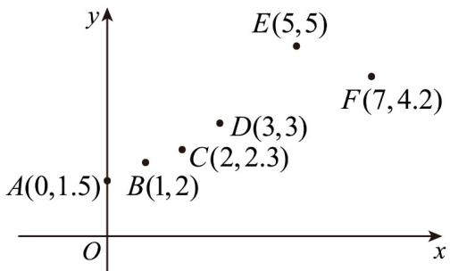

<!-- question-source:start -->
【变式1】某同学用收集到的6组数据对 $(x_{i},y_{i})(i = 1,2,3,4,5,6)$ 制作成如图所示的散点图（点旁的数据为该点坐标），并由最小二乘法计算得到回归直线 $l_{1}$ 的方程： $\hat{y} = \hat{b}_1x + \hat{a}_1$ ，相关系数为 $r_1$ ，相关指数为 $R_1^2$ ；经过残差分析确定点 $E$ 为“离群点”（对应残差过大的点），把它去掉后，再用剩下的5组数据计算得到回归直线 $l_{2}$ 的方程： $\hat{y} = \hat{b}_2x + \hat{a}_2$ ，相关系数为 $r_2$ ，相关指数为 $R_2^2$ 。则以下结论中，不正确的是

A. $r_1 > 0, r_2 > 0$ B. $\hat{b}_1 > 0, \hat{b}_2 > 0$

C. $\hat{b}_1 > b_2$ D. $R_1^2 > R_2^2$
<!-- question-source:end -->

![[高中/课堂同步/题库/人教A版高中数学同步讲义(2026)/05_选择性必修第三册/第八章 成对数据的统计分析/讲义/专题8_1_成对数据的统计相关性_高效培优讲义_数学人教A版高二选择性/_compact/answers/Q00059914A1.md]]
