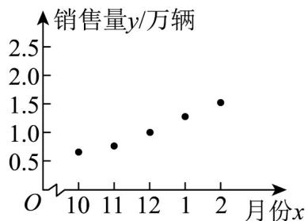

> [!faq]- 《专题8_1_成对数据的统计相关性_高效培优讲义_数学人教A版高二选择性》官方解析
>
> > [!success]- **【答案】** (1)作图见解析 (2)正相关关系
>
> > [!note]- **【分析】**
> > （1）根据表格中的数据即可作出散点图；
> >
> > (2) 由散点图即可判断 x 与 y 之间的相关关系.
>
> > [!note]- **【解析】**
> > （1）作出散点图如下：
> >
> > 
> >
> > (2) 由散点图可知， $^{5}$ 组样本数据呈正相关关系.
