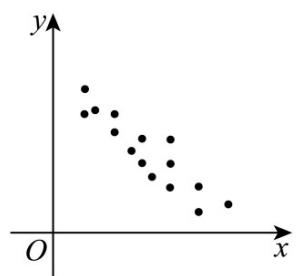

## 知识点 01 相关关系

1、相关关系

两个变量间的关系有函数关系，相关关系和不相关关系

两个变量有关系，但又没有确切到可由其中的一个去精确地决定另一个的程度，这种关系称为相关关系。

2、正相关、负相关

从整体上看，当一个变量的值增加时，另一个变量的相应值也呈现增加的趋势，我们就称这两个变量正相关；

如果一个变量值增加时，另一个变量的相应值呈现减少的趋势，则称这个两个变量负相关。

3、线性相关：

一般地，如果两个变量的取值呈现正相关或负相关，而且散点落在一条线附近，我们就称这两个变量线性相

关.

一般地，如果两个变量具有相关性，但不是线性相关，那么我们就称这两个变量非线性相关或曲线相关。

【即学即练】

1. 下图是两个分类变量 $x, y$ 取值绘制成的散点图，则图中变量 $x, y$ 具有线性相关关系的是（）

A.

B

C

D

【答案】BC

【分析】根据散点图的特征逐一验证即可得到答案·

【详解】由题意，

对于 $^{A}$ ：散点杂乱无章，无规律可言，看不出两个变量有什么相关性；故 $^{A}$ 错误；

对于 $^{B}$ ：呈正相关关系，分布在一条直线附近，具有线性相关关系；故 $^{B}$ 正确；

对于 $C$ ：两个变量具有负相关关系，分布在一条直线附近，具有线性相关关系；故 $C$ 正确；

对于 $^{D}$ ：两个变量具有相关性，但不是正相关，也不是负相关，故 $^{D}$ 错误·

故选：BC.

2. 某研究调查了 6 个城市的医院病床数量 $\left(X\right)$ 与年人均看病次数 $\left(Y\right)$ ，数据如下：

<table><tr><td>城市</td><td>病床数量(X)(万张)</td><td>年人均看病次数(Y)</td></tr><tr><td>A</td><td>0.8</td><td>3.1</td></tr><tr><td>B</td><td>1.2</td><td>4.0</td></tr><tr><td>C</td><td>1.5</td><td>4.6</td></tr><tr><td>D</td><td>2.0</td><td>5.9</td></tr><tr><td>E</td><td>2.5</td><td>6.7</td></tr><tr><td>F</td><td>3.0</td><td>7.8</td></tr></table>

散点图显示 $X$ 与 $Y$ 呈明显正相关·学生丙认为：“增加医院病床数量会使人们更容易生病，导致看病次数增加”

问：学生丙说的对吗？

【答案】学生丙说的不对

【分析】 $^{1}$ ·混淆相关与因果：学生丙将统计关联直接解释为“病床增加→生病增多”的因果关系；

2. 忽略混杂变量：实际存在隐藏变量——城市人口基数和老龄人口比例：人口多的城市需更多病床，同时因

基数大导致人均看病次数统计值更高；老龄化严重的城市对病床需求高，且老年人看病频率天然更高；

3.因果倒置风险：病床增加常是应对医疗需求的结果（需求高→增病床），而非致病原因

【详解】由题意，

对于相关性：表格中病床数量 $(X)$ 增加时，人均看病次数 $(Y)$ 同步上升，存在统计正相关。

对于因果性：若人为在偏远小镇新建医院 $(X \text{ 增加})$ ，但人口少且年轻，Y 不会显著上升·若某城市突发传染病

(Y 剧增)，病床数 X 不会自动增加·

结论：病床数量与人均看病次数的正相关反映共同影响因素的存在(人口结构、医疗需求)，但不能证明“病床

增加导致生病”，决策者若据此减少病床，反而会加剧医疗资源短缺，故学生丙说的不对·

3. 某食品科学家小张想研究一种新型固体饮料粉末（Y）在冷水中的溶解速率（溶解所需时间，单位：秒）

与水初始温度（ $X$ ，单位： ${}^{\circ}\mathrm{C}$ ）之间的关系·他初步进行了少量实验，收集了以下5组数据：

<table><tr><td>水温(X)</td><td>溶解时间(Y)</td></tr><tr><td>5</td><td>120</td></tr><tr><td>10</td><td>90</td></tr><tr><td>15</td><td>105</td></tr><tr><td>20</td><td>60</td></tr><tr><td>25</td><td>110</td></tr></table>

小张观察这 $^{5}$ 个数据点，发现水温升高时，溶解时间并没有呈现出明显一致的下降趋势（例如 $15^{\circ}C$ 时时间较

长， $25^{\circ}\mathrm{C}$ 时时间也较长）·他初步判断：“水温对这款饮料的溶解速率似乎没有显著影响，或者影响规律不明

显。”

问题：

(1)小张基于这 $^{5}$ 组数据得出的初步结论可能有什么问题？结合数据具体解释·

(2)为什么仅凭这 $^{5}$ 个数据点就下结论是危险的？请解释样本量不足在评估变量关系时可能导致什么错误。

(3)为了更准确地了解水温 $(X)$ 与溶解时间 $(Y)$ 的真实关系，小张应该怎么做？如果他增加了样本量（例如再

做 $^{20}$ 次严格控制的实验），可能会观察到什么不同的现象？

【答案】(1)样本数量太少、信息量有限、包含异常数据、随机波动掩盖趋势；

(2) 易受极端值 / 异常值影响、统计功效低、无法捕捉潜在规律；

(3)显著增加样本量（n>5），最好增至20-30组，可能观察到的现象见解析

【分析】（1）从样本量少、信息量有限、包含异常数据、正确且有用信息未显示被掩盖等出发分析即可；

(2) 根据变量的相关关系方面定义、数据特点、统计影响等方面出发分析即可；

(3) 从统计的科学性角度出发即可得解·

【详解】由题意，

(1) 样本量太小 (n=5): 只有 $^{5}$ 个数据点，信息量极其有限，数据点包含“异常”或“扰动”：

$15^{\circ} \mathrm{C}$ 时溶解时间 $^{105}$ 秒偏长； $25^{\circ} \mathrm{C}$ 时溶解时间 $^{110}$ 秒偏长·

随机波动掩盖趋势：在水温升高溶解时间减少存在的情况下，小样本中少数几个受干扰的数据点所产生

的随机波动，完全可能暂时掩盖掉潜在的真实趋势·

当前 $^{5}$ 个点看起来就是“高高低低”，没有明确规律·

(2) 易受极端值 / 异常值影响：小样本中，任何一个异常数据点，如受干扰的 $15^{\circ} \mathrm{C}$ 和 $25^{\circ} \mathrm{C}$ 数据，

对整体数据模式的权重都会被不成比例地放大，扭曲对整体关系的判断·

统计功效低：即使存在真实的、中等强度的负相关，水温越高，时间越短，

小样本也可能因为随机波动而无法可靠地检测到这种关系，导致第二类错误，

误以为没有关系而实际上有关系·结果不稳定且不可靠，小样本得出的结论对特定抽到的几个数据点非常敏感

再抽另外 $^{5}$ 个点，可能看起来像正相关、负相关或无相关·结论缺乏代表性和可重复性·

无法捕捉潜在规律：变量间的关系，尤其是非线性关系需要足够的数据点才能清晰地显现其模式，

5 个点太少，难以区分是随机噪声还是真实模式。

(3) 显著增加样本量 (n > 5): 小张应该进行更多次、严格控制实验条件的实验,

例如：确保搅拌均匀、粉末完全分散、记录准确·

建议至少增加到20-30个或更多不同水温下的数据点·

可能观察到的现象：随着样本量增加，实验过程中偶然的干扰，如一次搅拌失误、一次结块，对整体数据模

式的影响会被稀释·
