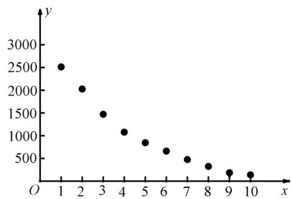

## 题型02 散点图及其应用

【典例1】 $x$ 和 $y$ 的散点图如图所示，则下列说法中所有正确命题的序号为

① x，y 是负相关关系；

② x，y 之间不能建立线性回归方程；

③在该相关关系中，若用 $y = c_{1} e^{c_{2} x}$ 拟合时的相关指数为 $R_{1}^{2}$ ，用 $\hat{y} = \hat{b} x + \hat{a}$ 拟合时的相关指数为 $R_{2}^{2}$ ，则 $R_{1}^{2} > R_{2}^{2}$ .

【答案】①③

【分析】由图可知，散点图呈整体下降趋势，据此判断①的正误；由试验数据得到的点将散布在某一直线周

围，因此，可以认为关于的回归函数的类型为线性函数，据此判断②的正误；根据散点图比较两个方程的拟

合效果，比较那个拟合效果更好，据此判断③；

【详解】在散点图中，点散布在从左上角到右下角的区域，因此 $x$ ， $y$ 是负相关关系，故①正确；

x，y之间可以建立线性回归方程，但拟合效果不好，故②错误；

由散点图知用 $y = c_{1} e^{c_{2} x}$ 拟合比用 $\hat{y} = \hat{b} x + \hat{a}$ 拟合效果要好，则 $R_{1}^{2} > R_{2}^{2}$ ，故③正确.

故答案为：①③·

## 方法技巧

1、画散点图时应注意合理选择单位长度，避免图形过大或偏小，或者是点的坐标在坐标系中画不准，使图形失真，导致得出错误结论。

2、在这里利用散点图直观感知事物的形态与变化，理解事物间的关联及变化规律，是数学核心素养直观想象

的具体体现．

![[高中/课堂同步/题库/人教A版高中数学同步讲义(2026)/05_选择性必修第三册/第八章 成对数据的统计分析/讲义/专题8_1_成对数据的统计相关性_高效培优讲义_数学人教A版高二选择性/_compact/Q00059914.md]]
![[高中/课堂同步/题库/人教A版高中数学同步讲义(2026)/05_选择性必修第三册/第八章 成对数据的统计分析/讲义/专题8_1_成对数据的统计相关性_高效培优讲义_数学人教A版高二选择性/_compact/Q00059915.md]]
![[高中/课堂同步/题库/人教A版高中数学同步讲义(2026)/05_选择性必修第三册/第八章 成对数据的统计分析/讲义/专题8_1_成对数据的统计相关性_高效培优讲义_数学人教A版高二选择性/_compact/Q00059916.md]]
