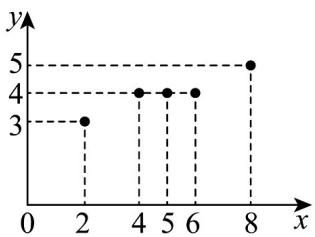

<!-- question-source:start -->
【变式2】根据统计，某蔬菜基地西红柿亩产量的增加量 $y$ （单位：百千克）与某种液体肥料每亩使用量 $x$

（单位：千克）之间的对应数据的散点图如图所示.

(1)依据数据的散点图可以看出，可用线性回归模型拟合 $y$ 与 $x$ 的关系，请计算相关系数 $r$ ，并说明线性相关性的强弱（相关系数 $r$ 精确到小数点后2位，若 $|r| > 0.75$ ，则线性相关程度很高）；

(2)求 $y$ 关于 $x$ 的线性回归方程，并预测液体肥料每亩使用量为12千克时，西红柿亩产量的增加量 $y$ 约为多少

百千克.

附：数据和公式： $\sum_{i = 1}^{5}\left(x_i - \overline{x}\right)\left(y_i - \overline{y}\right) = 6;\sum_{i = 1}^{5}\left(x_i - \overline{x}\right)^2 = 20;\sum_{i = 1}^{5}\left(y_i - \overline{y}\right)^2 = 2;\sqrt{10}\approx 3.16$ ；回归方程： $\hat{y} = \hat{b} x + \hat{a}$

其中 $\hat{b} = \frac{\sum_{i=1}^{n}\left(x_i - \overline{x}\right)\left(y_i - \overline{y}\right)}{\sum_{i=1}^{n}\left(x_i - \overline{x}\right)^2},\hat{a} = \overline{y} -\hat{b}\overline{x}$ 相关系数： $r = \frac{\sum_{i=1}^{n}\left(x_i - \overline{x}\right)\left(y_i - \overline{y}\right)}{\sqrt{\sum_{i=1}^{n}\left(x_i - \overline{x}\right)^2}\cdot\sqrt{\sum_{i=1}^{n}\left(y_i - \overline{y}\right)^2}}.$
<!-- question-source:end -->

![[高中/课堂同步/题库/人教A版高中数学同步讲义(2026)/05_选择性必修第三册/第八章 成对数据的统计分析/讲义/专题8_2_一元线性回归模型及其应用_高效培优讲义_数学人教A版高二选/_compact/answers/Q00059934A1.md]]
