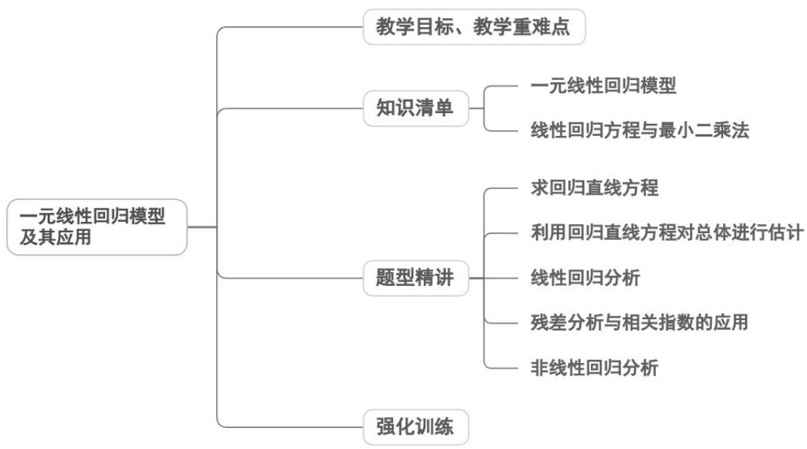

## 专题8.2 一元线性回归模型及其应用

## 内容概览

## 教学目标、教学重难点

<table><tr><td>教学目标</td><td>1.解一元线性回归模型的结构,区分线性回归直线方程与函数解析式的本质差异,掌握最小二乘法的核心思想。2.能运用公式求解线性回归方程的系数和截距,会用回归方程进行简单的预测分析。3.了解残差、残差图的含义,能通过残差判断模型的拟合效果,知晓线性回归模型的适用范围。</td></tr><tr><td>教学重难点</td><td>1.重点用线性回归方程对实际问题进行预测,能解释回归系数的实际意义。2.难点区分线性回归直线与散点图中近似直线的差异,理解回归方程的统计意义(非确定函数关系)。</td></tr></table>
