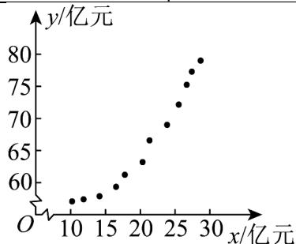

<!-- question-source:start -->
10. 某研发团队实现了从单点光谱仪到超光谱成像芯片的跨越。为制定下一年的研发投入计划，该研发团队

需要了解年研发资金投入 $X$ （单位：亿元）对年销售额 $Y$ （单位：亿元）的影响．结合近 $^{12}$ 年的年研发资金

投入 $X$ 和年销售额 $Y$ ，该团队建立了两个函数模型：① $Y = \alpha +\beta X^2$ ，② $Y = \mathrm{e}^{\lambda X + t}$ ，其中 $\alpha ,\beta ,\lambda ,t$ 均为常数，e

为自然对数的底数．经对数据的初步处理，得到散点图如图．令 $u_{i}=x_{i}^{2}$ ， $v_{i}=\ln y_{i}(i=1,2,\cdots,12)$ ，计算得到如

下数据.

<table><tr><td> $\overline{x}$ </td><td> $\overline{y}$ </td><td> $\sum_{i=1}^{12}\left(x_i - \overline{x}\right)^2$ </td><td> $\sum_{i=1}^{12}\left(y_i - \overline{y}\right)^2$ </td><td> $\sum_{i=1}^{12}\left(x_i - \overline{x}\right)\left(v_i - \overline{v}\right)$ </td></tr><tr><td>20</td><td>66</td><td>770</td><td>200</td><td>14</td></tr><tr><td> $\overline{u}$ </td><td> $\overline{v}$ </td><td> $\sum_{i=1}^{12}\left(u_i - \overline{u}\right)^2$ </td><td> $\sum_{i=1}^{12}\left(v_i - \overline{v}\right)^2$ </td><td> $\sum_{i=1}^{12}\left(u_i - \overline{u}\right)\left(y_i - \overline{y}\right)$ </td></tr><tr><td>460</td><td>4.20</td><td>3125000</td><td>0.308</td><td>21500</td></tr></table>

(1)设变量 $U$ 和变量 $Y$ 的样本相关系数为 $r_1$ ，变量 $X$ 和变量 $V$ 的样本相关系数为 $r_2$ ，请从样本相关系数的角度，

选择一个 $Y$ 与 $X$ 相关性较强的模型.

(2) (i) 根据 (1) 的选择及表中数据，建立 Y 关于 X 的回归方程（系数精确到 0.01）；

(ii) 若下一年销售额需达到 $^{80}$ 亿元，预测下一年的研发资金投入。

附： $\sqrt{237.16} = 15.4$ ， $\mathrm{e}^{4.382}\approx 80$
<!-- question-source:end -->

![[高中/课堂同步/题库/人教A版高中数学同步讲义(2026)/05_选择性必修第三册/第八章 成对数据的统计分析/讲义/专题8_2_一元线性回归模型及其应用_高效培优讲义_数学人教A版高二选/强化训练_sec_12/questions/answers/Q00059949A1.md]]
