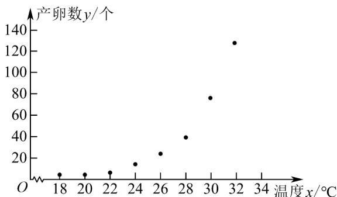
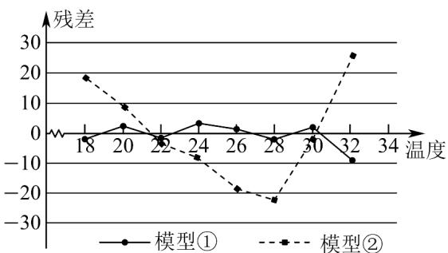

## 题型05 非线性回归分析

【典例1】红铃虫（Pectinophora gossypiella）是棉花的主要害虫之一，其产卵数与温度有关·现收集到一只红

铃虫的产卵数 $y$ （个）和温度 $x$ （°C）的 $^{8}$ 组观测数据，制成图 $^{1}$ 所示的散点图·现用两种模型① $y = \mathrm{e}^{bx + a}$ ，②

$$
y = c x ^ {2} + d
$$

分别进行拟合，由此得到相应的回归方程并进行残差分析，进一步得到图 $^{2}$ 所示的残差图·

图1 产卵数散点图

图2 两种模型的残差图

根据收集到的数据，计算得到如下值：表中 $z_{i} = \ln y_{i}$ ； $\overline{z} = \frac{1}{8}\sum_{i = 1}^{8}z_{i}$ ； $t_i = x_i^2$ ； $\overline{t} = \frac{1}{8}\sum_{i = 1}^{8}t_i$

(1)根据残差图，比较模型①、②的拟合效果，应选择哪个模型？并说明理由；

(2)根据（1）中所选择的模型，求出 $y$ 关于 $x$ 的回归方程（系数精确到0.01），并求温度为 $34^{\circ}\mathrm{C}$ 时，产卵数 $y$

的预报值·

(参考数据： $e^{5.18}\approx178$ ， $e^{5.46}\approx235$ ， $e^{5.52}\approx250$ ， $e^{5.83}\approx340$ )

附：对于一组数据 $\left(\omega_1,v_1\right)$ ， $\left(\omega_2,v_2\right)$ ，…， $\left(\omega_n,v_n\right)$ ，其回归直线 $\hat{v} = \hat{\alpha} +\hat{\beta}\omega$ 的斜率和截距的最小二乘估计分别

$$
\text {为} \hat {\beta} = \frac {\sum_ {i = 1} ^ {n} \left(\omega_ {i} - \bar {\omega}\right) \left(v _ {i} - \bar {v}\right)}{\sum_ {i = 1} ^ {n} \left(\omega_ {i} - \bar {\omega}\right) ^ {2}}, \quad \hat {\alpha} = \bar {v} - \hat {\beta} \bar {\omega}.
$$

<table><tr><td> $\overline{x}$ </td><td> $\overline{z}$ </td><td> $\overline{t}$ </td><td> $\sum_{i=1}^{8}\left(x_i - \overline{x}\right)^2$ </td><td> $\sum_{i=1}^{8}\left(t_i - \overline{t}\right)^2$ </td><td> $\sum_{i=1}^{8}\left(z_i - \overline{z}\right)\left(x_i - \overline{x}\right)$ </td><td> $\sum_{i=1}^{8}\left(y_i - \overline{y}\right)\left(t_i - \overline{t}\right)$ </td></tr><tr><td>25</td><td>2.89</td><td>646</td><td>168</td><td>422688</td><td>48.48</td><td>70308</td></tr></table>

【答案】 $^{(1)}$ 应该选择模型①，理由见解析

(2) $\hat{y}=e^{0.29x-4.34}$ ; 250个

【分析】（1）由模型①的残差点比较均匀落在水平的带状区域以及带状区域的宽度窄，所以选择模型①比较

合适；

(2) 令 $z = \ln y$ ， $z$ 与温度 $x$ 可以用线性回归方程来拟合，则 $\hat{z} = \hat{a} + \hat{b} x$ ，利用公式和数据求出 $\hat{a}$ 和 $\hat{b}$ ，则可以

得到 y 关于温度 x 的回归方程，当 x = 34 时，可求出产卵数 y 的预报值。

【详解】（1）应该选择模型①·

由于模型①残差点比较均匀地落在水平的带状区域中，

且带状区域的宽度比模型②带状宽度窄，所以模型①的拟合精度更高，

回归方程的预报精度相应就会越高，故选模型①比较合适

(2) 令 $z = \ln y$ ， $z$ 与温度 $x$ 可以用线性回归方程来拟合，则 $\hat{z} = \hat{a} + \hat{b}x$ .

$$
\hat {b} = \frac {\sum_ {i = 1} ^ {8} \left(z _ {i} - \bar {z}\right) \left(x _ {i} - \bar {x}\right)}{\sum_ {i = 1} ^ {8} \left(x _ {i} - \bar {x}\right) ^ {2}} = \frac {4 8 . 4 8}{1 6 8} \approx 0. 2 8 9
$$

所以 $\hat{a} = \overline{z} - \hat{b}\overline{x} = 2.89 - 0.289 \times 25 \approx -4.34$

则 z 关于 x 的线性回归方程为 $\hat{z}=0.29x-4.34$ .

于是有 $\ln y = 0.29x - 4.34$

所以产卵数 y 关于温度 x 的回归方程为 $\hat{y} = e^{0.29x - 4.34}$

当 $x = 34$ 时， $y = \mathrm{e}^{0.29 \times 34 - 4.34} = \mathrm{e}^{5.52} \approx 250$ （个）.

所以，在气温在 $34^{\circ}\mathrm{C}$ 时，一个红铃虫的产卵数的预报值为250个

## 方法技巧

求非线性回归方程的步骤

(1)确定变量，作出散点图.

(2)根据散点图，选择恰当的拟合函数.

(3)变量置换，通过变量置换把非线性回归问题转化为线性回归问题，并求出线性回归方程.

(4)分析拟合效果：通过计算决定系数或画残差图来判断拟合效果.

(5)根据相应的变换，写出非线性回归方程.

![[高中/课堂同步/题库/人教A版高中数学同步讲义(2026)/05_选择性必修第三册/第八章 成对数据的统计分析/讲义/专题8_2_一元线性回归模型及其应用_高效培优讲义_数学人教A版高二选/_compact/Q00059939.md]]
![[高中/课堂同步/题库/人教A版高中数学同步讲义(2026)/05_选择性必修第三册/第八章 成对数据的统计分析/讲义/专题8_2_一元线性回归模型及其应用_高效培优讲义_数学人教A版高二选/_compact/Q00059940.md]]
![[高中/课堂同步/题库/人教A版高中数学同步讲义(2026)/05_选择性必修第三册/第八章 成对数据的统计分析/讲义/专题8_2_一元线性回归模型及其应用_高效培优讲义_数学人教A版高二选/_compact/Q00059941.md]]
