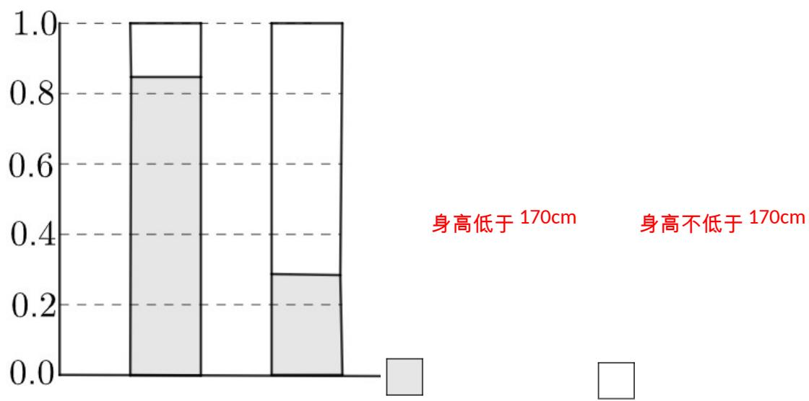

<!-- question-source:start -->
【变式3】为了研究高三年级学生的性别和身高是否大于 $170\mathrm{cm}$ 的问题，得到某中学高三年级学生的性别和

身高的所有观测数据所对应的列联表如下：

单位：人

<table><tr><td rowspan="2">性别</td><td colspan="2">身高</td><td rowspan="2">合计</td></tr><tr><td>低于 170cm</td><td>不低于 170cm</td></tr><tr><td>女</td><td>81</td><td>16</td><td>97</td></tr><tr><td>男</td><td>28</td><td>75</td><td>103</td></tr><tr><td>合计</td><td>109</td><td>91</td><td>200</td></tr></table>

（1）请画出列联表的等高堆积条形图，判断该中学高三年级学生的性别和身高是否有关联．如果结论是性别

与身高有关联，请解释它们之间如何相互影响。

(2) 身高变量是数值型变量还是分类变量？为什么？
<!-- question-source:end -->

![[高中/课堂同步/题库/人教A版高中数学同步讲义(2026)/05_选择性必修第三册/第八章 成对数据的统计分析/讲义/专题8_3_列联表与独立性检验_高效培优讲义_数学人教A版高二选择性必/_compact/answers/Q00059955A1.md]]
