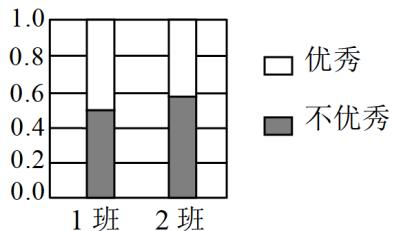

<!-- question-source:start -->
【变式3】如图是学校高二 $^{1,2}$ 班本期中考试数学成绩优秀率的等高堆积条形图，如果再从两个班中各随机

抽 $^{6}$ 名学生的期中考试数学成绩统计，那么（）

A. 两个班 $^{6}$ 名学生的数学成绩优秀率可能相等
B. 1 班 $^{6}$ 名学生的数学成绩优秀率一定高于 $^{2}$ 班
C. 2 班 $^{6}$ 名学生中数学成绩不优秀的一定多于优秀的
D. “两班学生的数学成绩优秀率存在差异”判断一定正确
<!-- question-source:end -->

![[高中/课堂同步/题库/人教A版高中数学同步讲义(2026)/05_选择性必修第三册/第八章 成对数据的统计分析/讲义/专题8_3_列联表与独立性检验_高效培优讲义_数学人教A版高二选择性必/_compact/answers/Q00059958A1.md]]
