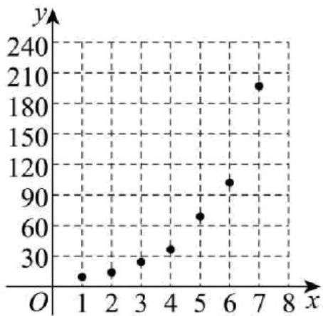

<!-- question-source:start -->
【变式1】某公司计划对未开通共享电动车的某市进行车辆投放，为了确定车辆投放量，对过去在其他城市

的投放量情况以及年使用人次进行了统计，得到了投放量 $x$ （单位：千辆）与年使用人次 $y$ （单位：千次）

的数据如下表所示，根据数据绘制投放量 x 与年使用人次 y 的散点图如图所示。

<table><tr><td>x</td><td>1</td><td>2</td><td>3</td><td>4</td><td>5</td><td>6</td><td>7</td></tr><tr><td>y</td><td>6</td><td>11</td><td>21</td><td>34</td><td>66</td><td>101</td><td>196</td></tr></table>

(1)观察散点图，可知两个变量不具有线性相关关系，拟用对数函数模型 $y = a + b\lg x$ 或指数函数模型

$y = c \cdot d^{x} (c > 0, d > 0)$ 对两个变量的关系进行拟合．请问哪个模型更适宜作为投放量 $^{x}$ 与年使用人次 $^{y}$ 的回归

方程类型（给出判断即可，不必说明理由）？并求出 $y$ 关于 $x$ 的回归方程；

(2)公司为了测试共享电动车的性能，从所有同型号共享电动车中随机抽取 $100$ 辆进行等距离骑行测试，骑行

前对其中 $^{60}$ 台进行保养，测试结束后，有 $^{20}$ 台报废，其中保养过的共享电动车占比 $^{20\%}$ ．请根据统计数据

完成 $2 \times 2$ 列联表，并根据小概率值 $\alpha = 0.001$ 的独立性检验，能否认为共享电动车是否报废与保养有关？

<table><tr><td>\</td><td>保养</td><td>未保养</td><td>合计</td></tr><tr><td>报废</td><td></td><td></td><td>20</td></tr><tr><td>未报废</td><td></td><td></td><td></td></tr><tr><td>合计</td><td>60</td><td></td><td>100</td></tr></table>

<table><tr><td> $\overline{y}$ </td><td> $\overline{v}$ </td><td> $\sum_{i=1}^{7} x_i y_i$ </td><td> $\sum_{i=1}^{7} x_i v_i$ </td><td> $10^{0.54}$ </td></tr><tr><td>62.14</td><td>1.54</td><td>2535</td><td>50.12</td><td>3.47</td></tr></table>

参考数据： $v_{i}=\lg y_{i},\bar{v}=\frac{1}{7}\sum_{i=1}^{n}v_{i}$

参考公式：对于一组数据 $(x_{1},y_{1}),(x_{2},y_{2}),\cdots(x_{n},y_{n})$ ，其回归直线的斜率和截距的最小二乘估计公式分别为：

$$
\hat {b} = \frac {\sum_ {i = 1} ^ {n} \left(x _ {i} - \bar {x}\right) \left(y _ {i} - \bar {y}\right)}{\sum_ {i = 1} ^ {n} \left(x _ {i} - \bar {x}\right) ^ {2}} = \frac {\sum_ {i = 1} ^ {n} x _ {i} y _ {i} - n \overline {{{x y}}}}{\sum_ {i = 1} ^ {n} \left(x _ {i} - \bar {x}\right) ^ {2}}, \hat {a} = \bar {y} - \hat {b} \bar {x}. \chi^ {2} = \frac {n (a d - b c) ^ {2}}{(a + b) (c + d) (a + c) (b + d)},
$$

其中 $n = a + b + c + d$

<table><tr><td> $P(x^{2} \quad k)$ </td><td>0.25</td><td>0.1</td><td>0.05</td><td>0.025</td><td>0.01</td><td>0.001</td></tr><tr><td>k</td><td>1.323</td><td>2.706</td><td>3.841</td><td>5.024</td><td>6.635</td><td>10.828</td></tr></table>
<!-- question-source:end -->

![[高中/课堂同步/题库/人教A版高中数学同步讲义(2026)/05_选择性必修第三册/第八章 成对数据的统计分析/讲义/专题8_3_列联表与独立性检验_高效培优讲义_数学人教A版高二选择性必/_compact/answers/Q00059962A1.md]]
