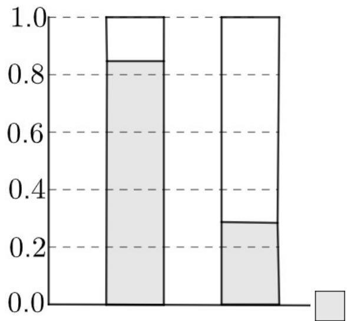

> [!faq]- 《专题8_3_列联表与独立性检验_高效培优讲义_数学人教A版高二选择性必》官方解析
>
> > [!success]- **【答案】** （ $^{1}$ ）答案见解析；（ $^{1}$ ）数值型变量，原因见解析·
>
> > [!note]- **【分析】**
> > （ $^{1}$ ）根据题意作出列联表的等高堆积条形图，然后根据图形分析即可；
> >
> > (2) 根据数值型变量与分类变量的概念即可得出结果.
>
> > [!note]- **【解析】**
> > （1）女学生身高低于 $170\mathrm{cm}$ ，不低于 $170\mathrm{cm}$ 得频率分别为 $\frac{81}{97} \approx 0.835, \frac{16}{97} \approx 0.165$
> >
> > 男学生身高低于 $170\mathrm{cm}$ ，不低于 $170\mathrm{cm}$ 得频率分别为 $\frac{28}{103} \approx 0.272, \frac{75}{103} \approx 0.728$
> >
> > 则列联表的等高堆积条形图为
> >
> > 
> >
> > 女生 男生
> >
> > 通过比较发现，如果从女生男生中各随机选取一名学生，女生中身高低于 $170\mathrm{cm}$ 的概率大于男生中身高低于
> >
> > 170cm 的概率，故该中学高三年级学生的性别和身高有关联，
> >
> > 又 $\frac{0.835}{0.272} \approx 3.07$ ，故女生中身高低于 $170\mathrm{cm}$ 的频率是男生中身高低于 $170\mathrm{cm}$ 的频率的 $^3$ 倍以上；
> >
> > (2) 身高变量是数值型变量，因为身高可以取不同的数值.
