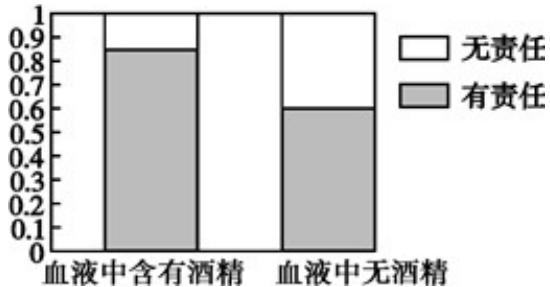

> [!faq]- 《专题8_3_列联表与独立性检验_高效培优讲义_数学人教A版高二选择性必》官方解析
>
> > [!success]- **【答案】** 在犯错误的概率不超过0.001的前提下，认为司机血液中含有酒精与对事故负有责任有关系。
>
> > [!note]- **【解析】**
> > 相应的等高条形图如下图所示：
> >
> > 
> >
> > 图中两个深色条的高分别表示司机血液中含有酒精和无酒精样本中对事故负有责任的频率，
> >
> > 从图中可以看出，司机血液中含有酒精样本中对事故负有责任的频率明显高于司机血液中无酒精样本中对事
> >
> > 故负有责任的频率.
> >
> > 由此可以认为司机血液中含有酒精与对事故负有责任有关系。
> >
> > 由列联表中的数据，得 $K^2$ 的观测值为 $k = \frac{2000\times(650\times 500 - 150\times 700)^2}{800\times 1200\times 1350\times 650}\approx 114.910 > 10.828$
> >
> > 因此，在犯错误的概率不超过0.001的前提下，认为司机血液中含有酒精与对事故负有责任有关系。
