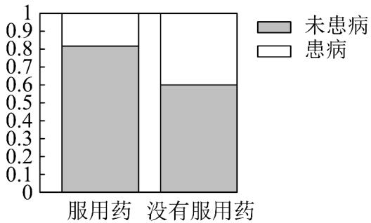

> [!faq]- 《专题8_3_列联表与独立性检验_高效培优讲义_数学人教A版高二选择性必》官方解析
>
> > [!success]- **【答案】** 有关联.
>
> > [!note]- **【分析】**
> > 作出相应的等高堆积条形图，从图形分析出判断服用药与患病之间是否有关联·
>
> > [!note]- **【解析】**
> > 相应的等高堆积条形图如图所示.
> >
> > 
> >
> > 从图形可以看出，服用药的样本中患病的比例明显低于没有服用药的样本中患病的比例，因此可以认为服用
> >
> > 药与患病之间有关联。
