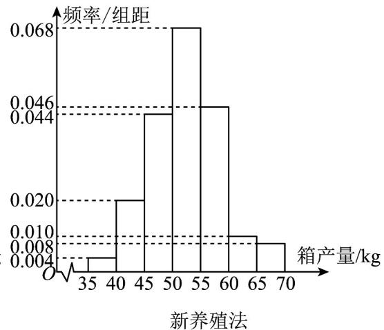
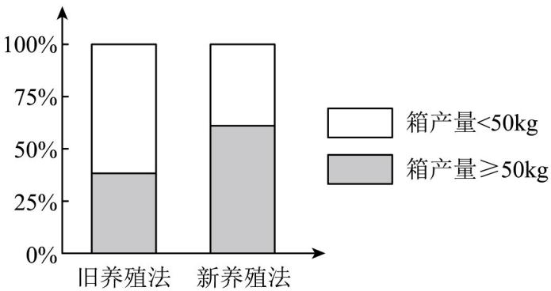

## 题型02 用等高堆积条形图分析两分类变量间的关系

【典例1】海水养殖场进行某水产品的新、旧网箱养殖方法的产量对比，收获时各随机抽取了 $100$ 个网箱，

测量各箱水产品的产量（单位：kg），其频率分布直方图如下：

殖方法有关；

(2) 根据列联表判断是否有 $99\%$ 的把握认为箱产量与养殖方法有关？

<table><tr><td></td><td>箱产量&lt;50kg</td><td>箱产量≥50kg</td></tr><tr><td>旧养殖法</td><td></td><td></td></tr><tr><td>新养殖法</td><td></td><td></td></tr></table>

参考公式：

(1) 给定临界值表

<table><tr><td> $P(K \geq k_0)$ </td><td>0.50</td><td>0.40</td><td>0.25</td><td>0.15</td><td>0.10</td><td>0.05</td><td>0.025</td><td>0.010</td><td>0.005</td><td>0.001</td></tr><tr><td> $k_0$ </td><td>0.455</td><td>0.708</td><td>1.323</td><td>2.072</td><td>2.706</td><td>3.841</td><td>5.024</td><td>6.635</td><td>7.879</td><td>10.828</td></tr></table>

(2) $K^{2} = \frac{n(ad - bc)^{2}}{(a + b)(c + d)(a + c)(b + d)}$ 其中 $n = a + b + c + d$ 为样本容量·

【答案】（1）表格见解析，有关；（2）有 $99\%$ 的把握认为箱产量与养殖方法有关·

【分析】（1）从频率分布直方图中找出相应数据完善表格，画出等高条形图，做出判断即可；（2）由联表

中数据，计算出 $K^{2}$ ，结合临界值表做出判断·

【详解】（1）列联表如下：

<table><tr><td></td><td>箱产量&lt;50kg</td><td>箱产量≥50kg</td><td>合计</td></tr><tr><td>旧养殖法</td><td>62</td><td>38</td><td>100</td></tr><tr><td>新养殖法</td><td>34</td><td>66</td><td>100</td></tr><tr><td>合计</td><td>96</td><td>104</td><td>200</td></tr></table>

由等高条形图可知新养殖法箱产量 $\geq 50\mathrm{kg}$ 占 $66\%$ ，而旧养殖法箱产量 $\geq 50\mathrm{kg}$ 才占 $38\%$ ，有比较明显的差别，所

以箱产量与新、旧网箱养殖方法有关·

(2) 由列联表中的数据计算可得 $k^2$ 的观测值为

$$
K ^ {2} = \frac {2 0 0 \times (6 2 \times 6 6 - 3 8 \times 3 4) ^ {2}}{1 0 0 \times 1 0 0 \times 9 6 \times 1 0 4} = \frac {2 0 0 \times 1 6 (3 1 \times 3 3 - 1 9 \times 1 7) ^ {2}}{1 0 0 \times 1 0 0 \times 9 6 \times 1 0 4} = \frac {7 0 0 ^ {2}}{1 0 0 \times 3 \times 1 0 4} = \frac {4 9 0 0}{3 1 2} \approx 1 5. 7 0 5 > 6. 6 3 5
$$

故有 99% 的把握认为箱产量与养殖方法有关·

![[高中/课堂同步/题库/人教A版高中数学同步讲义(2026)/05_选择性必修第三册/第八章 成对数据的统计分析/讲义/专题8_3_列联表与独立性检验_高效培优讲义_数学人教A版高二选择性必/_compact/Q00059956.md]]
![[高中/课堂同步/题库/人教A版高中数学同步讲义(2026)/05_选择性必修第三册/第八章 成对数据的统计分析/讲义/专题8_3_列联表与独立性检验_高效培优讲义_数学人教A版高二选择性必/_compact/Q00059957.md]]
![[高中/课堂同步/题库/人教A版高中数学同步讲义(2026)/05_选择性必修第三册/第八章 成对数据的统计分析/讲义/专题8_3_列联表与独立性检验_高效培优讲义_数学人教A版高二选择性必/_compact/Q00059958.md]]
