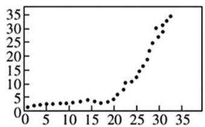
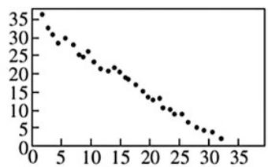
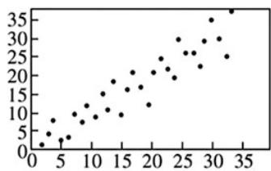

<!-- question-source:start -->
【变式1】以下是标号分别为①，②，③的三幅散点图，它们的样本相关系数分别为 $r_1, r_2, r_3$ ，那么相关系数

的大小关系为\_\_\_\_·（按由小到大的顺序排列）·

①

②

③
<!-- question-source:end -->

![[高中/课堂同步/题库/人教A版高中数学同步讲义(2026)/05_选择性必修第三册/第八章 成对数据的统计分析/讲义/第八章_成对数据的统计分析_高效培优讲义_数学人教A版高二选择性必修第/_compact/answers/Q00059990A1.md]]
