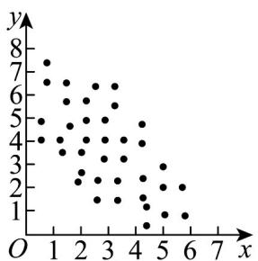
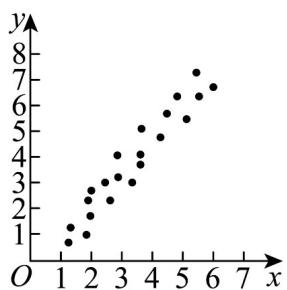

<!-- question-source:start -->
【变式3】观察下列散点图，其中两个变量的相关关系判断一定正确的是（）

图1

图2

图3

A. 图 $^{1}$ 中 y 与 x 呈正相关
B. 图 $^{2}$ 中 y 与 x 不相关
C. 图 $^{3}$ 中 y 与 x 的线性相关系数小于 0

D．图 1 中 y 与 x 的线性相关系数小于图 2 中 y 与 x 的线性相关系数
<!-- question-source:end -->

![[高中/课堂同步/题库/人教A版高中数学同步讲义(2026)/05_选择性必修第三册/第八章 成对数据的统计分析/讲义/第八章_成对数据的统计分析_高效培优讲义_数学人教A版高二选择性必修第/_compact/answers/Q00059992A1.md]]
