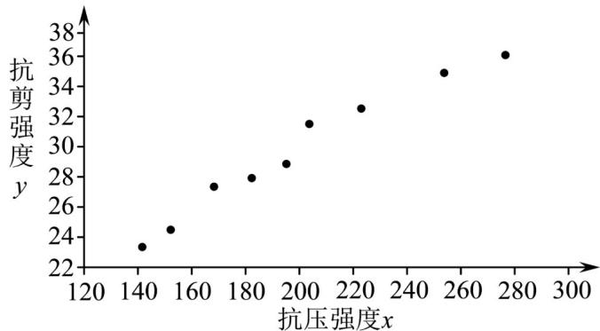

<!-- question-source:start -->
【变式3】混凝土的抗压强度x较容易测定，而抗剪强度y不易测定，工程中希望建立一种能由x推算y的经

验公式，下表列出了现有的 $9$ 对数据，分别为 $\left(x_{1},y_{1}\right),\left(x_{2},y_{2}\right),\ldots ,\left(x_{9},y_{9}\right)$

<table><tr><td rowspan="2">x</td><td>14</td><td>15</td><td>16</td><td>18</td><td>19</td><td>20</td><td>22</td><td>25</td><td>27</td></tr><tr><td>1</td><td>2</td><td>8</td><td>2</td><td>5</td><td>4</td><td>3</td><td>4</td><td>7</td></tr><tr><td rowspan="2">y</td><td>23.</td><td>24.</td><td>27.</td><td>27.</td><td>28.</td><td>31.</td><td>32.</td><td>34.</td><td>36.</td></tr><tr><td>1</td><td>2</td><td>2</td><td>8</td><td>7</td><td>4</td><td>5</td><td>8</td><td>2</td></tr></table>

以成对数据的抗压强度 $x$ 为横坐标，抗剪强度 $y$ 为纵坐标作出散点图，如图所示.

(1)从上表中任选 $^{2}$ 个成对数据，求该样本量为 $^{2}$ 的样本相关系数r．结合r值分析，由简单随机抽样得到的成

对样本数据的样本相关系数是否一定能确切地反映变量之间的线性相关关系？

(2)根据散点图，我们选择两种不同的函数模型作为回归曲线，根据一元线性回归模型及最小二乘法，得到经

验回归方程分别为：① $\hat{y} = \hat{b} x + \hat{a}$ ，② $\hat{y} = 17.8789\ln x - 75.2844$ 。经验回归方程①和②的残差计算公式分别为

$$
\hat {e} _ {i} = y _ {i} - \left(\hat {b} x _ {i} + \hat {a}\right), \hat {u} _ {i} = y _ {i} - \left(1 7. 8 7 8 9 \ln x _ {i} - 7 5. 2 8 4 4\right), i = 1, 2, \dots , 9
$$

(i) 求 $\sum_{i=1}^{9}\hat{e}_{i}$ ;

(ii) 经计算得经验回归方程①和②的残差平方和分别为 $Q_{1} = \sum_{i=1}^{9}\left(\hat{e}_{i}\right)^{2} = 5.0177$ ， $Q_{2} = \sum_{i=1}^{9}\left(\hat{u}_{i}\right)^{2} = 2.5007$ ，经验

回归方程①的决定系数 $R_{1}^{2} = 0.9693$ ，求经验回归方程②的决定系数 $R_{2}^{2}$

附：相关系数 $r=\frac{\sum_{i=1}^{n}\left(x_{i}-\bar{x}\right)\left(y_{i}-\bar{y}\right)}{\sqrt{\sum_{i=1}^{n}\left(x_{i}-\bar{x}\right)^{2}\sum_{i=1}^{n}\left(y_{i}-\bar{y}\right)^{2}}}$ ，决定系数 $R^{2}=1-\frac{\sum_{i=1}^{n}\left(y_{i}-\hat{y}_{i}\right)^{2}}{\sum_{i=1}^{n}\left(y_{i}-\bar{y}_{i}\right)^{2}}$ ， $\frac{2.5007\times0.0307}{5.0177}\approx0.01530$
<!-- question-source:end -->

![[高中/课堂同步/题库/人教A版高中数学同步讲义(2026)/05_选择性必修第三册/第八章 成对数据的统计分析/讲义/第八章_成对数据的统计分析_高效培优讲义_数学人教A版高二选择性必修第/_compact/answers/Q00060004A1.md]]
