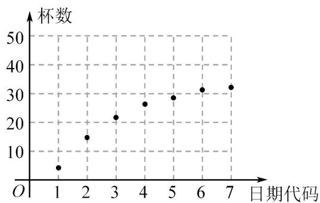

> [!faq]- 《第八章_成对数据的统计分析_高效培优讲义_数学人教A版高二选择性必修第》官方解析
>
> > [!success]- **【答案】** (1)图见解析， $y = c + d\ln x$ 更适宜作为 $y$ 关于 $x$ 的回归方程模型； (2) $y = 5.7 + 14.2 \ln x$ ，到第9天才能超过35杯； (3)分布列见解析·
>
> > [!note]- **【分析】**
> > $^{(1)}$ 根据散点图趋势即可判断；
> >
> > (2)利用非线性回归方程转化为线性回归方程的方法求解；
> >
> > (3)根据超几何分布求分布列·
>
> > [!note]- **【解析】**
> > （1）
> >
> > 
> >
> > 根据散点图，知 $y = c + d \ln x$ 更适宜作为 y 关于 x 的回归方程模型；
> >
> > (2) 令 $u = \ln x$ ，则 $y = c + du$ ，
> >
> > 由已知数据得 $\hat{d}=\frac{\sum_{i=1}^{7}x_{1}y_{1}-n\overline{xy}}{\sum_{i=1}^{7}x_{i}^{2}-n\overline{x}^{2}}=\frac{235.1-7\times22.7\times1.2}{13.2-7\times1.2\times1.2}\approx14.2$
> >
> > $\hat{c} = \overline{y} -\hat{d}\overline{u} = 22.7 - 14.2\times 1.2\approx 5.7$
> >
> > 所以 $\hat{y}=5.7+14.2u$
> >
> > 故 y 关于 x 的回归方程为 $y = 5.7 + 14.2 \ln x$
> >
> > 进而由题意知，令 $5.7 + 14.2\ln x > 35$ ，整理得 $\ln x > 2.1$ ，即 $x > \mathrm{e}^{2.1}\approx 8.2$
> >
> > 故当 $x = 9$ 时，即到第9天才能超过35杯；
> >
> > (3) 由题意知，这 $^{7}$ 天中销售超过 $^{25}$ 杯的有 $^{4}$ 天，则随机变量X的可能取值为0,1,2,3
> >
> > $$
> > P (X = 0) = \frac {\mathrm{C} _ {4} ^ {0} \mathrm{C} _ {3} ^ {3}}{\mathrm{C} _ {7} ^ {3}} = \frac {1}{3 5}, P (X = 1) = \frac {\mathrm{C} _ {4} ^ {1} \mathrm{C} _ {3} ^ {2}}{\mathrm{C} _ {7} ^ {3}} = \frac {1 2}{3 5},
> > $$
> >
> > $$
> > P (X = 2) = \frac {\mathrm{C} _ {4} ^ {2} \mathrm{C} _ {3} ^ {1}}{\mathrm{C} _ {7} ^ {3}} = \frac {1 8}{3 5}, P (X = 3) = \frac {\mathrm{C} _ {4} ^ {3} \mathrm{C} _ {3} ^ {0}}{\mathrm{C} _ {7} ^ {3}} = \frac {4}{3 5},
> > $$
> >
> > 则随机变量 $X$ 的分布列为
> >
> > <table><tr><td>X</td><td>0</td><td>1</td><td>2</td><td>3</td></tr><tr><td>P</td><td> $\frac{1}{35}$ </td><td> $\frac{12}{35}$ </td><td> $\frac{18}{35}$ </td><td> $\frac{4}{35}$ </td></tr></table>
