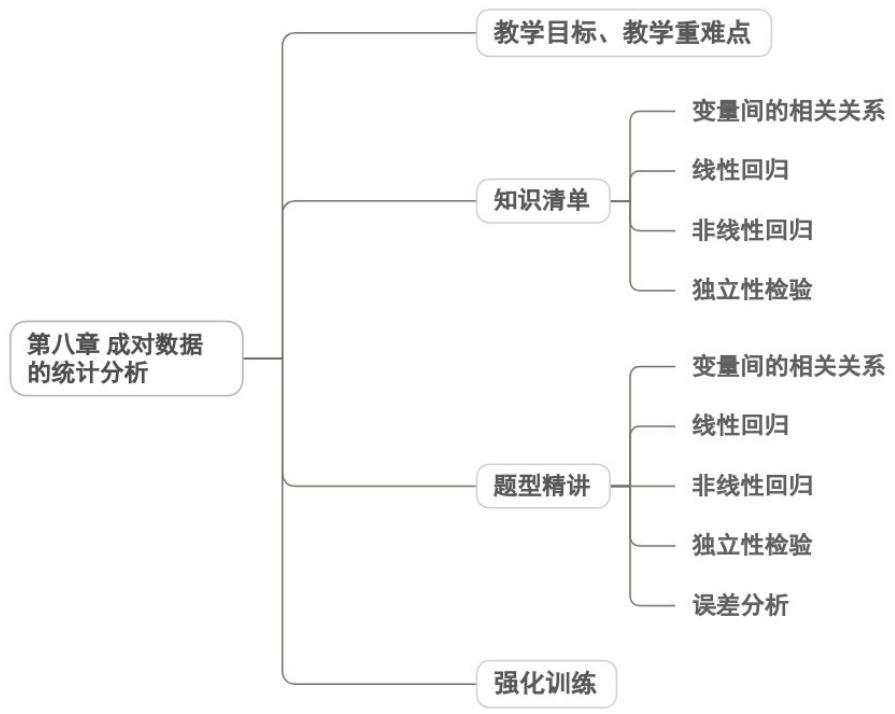

<!-- source-part:1 pages:1-50 -->

## 第八章 成对数据的统计分析

## 内容概览

## 教学目标、教学重难点

<table><tr><td>教学目标</td><td>1. 理解成对数据的含义,会画散点图,能通过散点图直观判断两个变量的线性相关与非线性相关、正相关与负相关。2. 掌握相关系数 r 的含义及计算,明确|r|越接近 1 线性相关越强,会根据 r 的符号判断相关方向,能利用相关系数定量刻画线性相关程度。3. 掌握线性回归方程 y=bx+a 的求法,熟记 b 计算公式,知道样本中心点(x,y)必在回归直线上,能准确求解回归系数。4. 理解残差、残差图的意义,会用残差分析回归模型的拟合效果;了解独立性检验的基本思想,会列 2×2 列联表,能计算统计量并判断变量关联性。</td></tr><tr><td>教学重难点</td><td>重点1.成对变量线性相关关系的判定:散点图直观判断+相关系数定量刻画,掌握正、负相关及线性相关强弱的判断方法。2.线性回归方程的求解与应用:熟练计算回归系数b和a,理解回归直线的意义,能利用方程进行简单预报。3.残差分析的应用:会计算残差、绘制残差图,能根据残差图判断回归模型的拟合效果。4.独立性检验的基本步骤:列联表构建、计算、临界值对比,能准确判断两个分类变量是否有关联。难点1.相关系数r的意义理解:难以理解r的取值与线性相关程度的内在联系,易混淆“相关强”与“因果关系”。2.回归系数b的含义与计算:对b的统计意义(x每变1个单位,y的平均变化量)理解模糊,计算过程易出错。3.残差分析的本质理解:不会通过残差图规律判断模型缺陷,分不清残差误差、系统误差与随机误差的区别。4.统计结论的正确解读:易误将“线性相关”等同于“因果关系”,对回归预报的估计性、独立性检验结论的概率性理解不到位。5.实际问题转化:难以将生活中的成对数据问题(如消费与收入)抽象为统计模型,找不到分析切入点。</td></tr></table>

![[高中/课堂同步/题库/人教A版高中数学同步讲义(2026)/05_选择性必修第三册/第八章 成对数据的统计分析/讲义/第八章_成对数据的统计分析_高效培优讲义_数学人教A版高二选择性必修第/知识清单_sec_01/知识清单_sec_01.md]]
![[高中/课堂同步/题库/人教A版高中数学同步讲义(2026)/05_选择性必修第三册/第八章 成对数据的统计分析/讲义/第八章_成对数据的统计分析_高效培优讲义_数学人教A版高二选择性必修第/知识点_01_变量间的相关关系_sec_02/知识点_01_变量间的相关关系_sec_02.md]]
![[高中/课堂同步/题库/人教A版高中数学同步讲义(2026)/05_选择性必修第三册/第八章 成对数据的统计分析/讲义/第八章_成对数据的统计分析_高效培优讲义_数学人教A版高二选择性必修第/即学即练_sec_03/即学即练_sec_03.md]]
![[高中/课堂同步/题库/人教A版高中数学同步讲义(2026)/05_选择性必修第三册/第八章 成对数据的统计分析/讲义/第八章_成对数据的统计分析_高效培优讲义_数学人教A版高二选择性必修第/知识点_02_线性回归_sec_04/知识点_02_线性回归_sec_04.md]]
![[高中/课堂同步/题库/人教A版高中数学同步讲义(2026)/05_选择性必修第三册/第八章 成对数据的统计分析/讲义/第八章_成对数据的统计分析_高效培优讲义_数学人教A版高二选择性必修第/知识点_03_非线性回归_sec_05/知识点_03_非线性回归_sec_05.md]]
![[高中/课堂同步/题库/人教A版高中数学同步讲义(2026)/05_选择性必修第三册/第八章 成对数据的统计分析/讲义/第八章_成对数据的统计分析_高效培优讲义_数学人教A版高二选择性必修第/即学即练_sec_06/即学即练_sec_06.md]]
![[高中/课堂同步/题库/人教A版高中数学同步讲义(2026)/05_选择性必修第三册/第八章 成对数据的统计分析/讲义/第八章_成对数据的统计分析_高效培优讲义_数学人教A版高二选择性必修第/即学即练_sec_07/即学即练_sec_07.md]]
![[高中/课堂同步/题库/人教A版高中数学同步讲义(2026)/05_选择性必修第三册/第八章 成对数据的统计分析/讲义/第八章_成对数据的统计分析_高效培优讲义_数学人教A版高二选择性必修第/题型精讲_sec_08/题型精讲_sec_08.md]]
![[高中/课堂同步/题库/人教A版高中数学同步讲义(2026)/05_选择性必修第三册/第八章 成对数据的统计分析/讲义/第八章_成对数据的统计分析_高效培优讲义_数学人教A版高二选择性必修第/题型01_变量间的相关关系_sec_09/题型01_变量间的相关关系_sec_09.md]]
![[高中/课堂同步/题库/人教A版高中数学同步讲义(2026)/05_选择性必修第三册/第八章 成对数据的统计分析/讲义/第八章_成对数据的统计分析_高效培优讲义_数学人教A版高二选择性必修第/题型02_线性回归_sec_10/题型02_线性回归_sec_10.md]]
![[高中/课堂同步/题库/人教A版高中数学同步讲义(2026)/05_选择性必修第三册/第八章 成对数据的统计分析/讲义/第八章_成对数据的统计分析_高效培优讲义_数学人教A版高二选择性必修第/题型03_非线性回归_sec_11/题型03_非线性回归_sec_11.md]]
![[高中/课堂同步/题库/人教A版高中数学同步讲义(2026)/05_选择性必修第三册/第八章 成对数据的统计分析/讲义/第八章_成对数据的统计分析_高效培优讲义_数学人教A版高二选择性必修第/题型_04_独立性检验_sec_12/题型_04_独立性检验_sec_12.md]]
![[高中/课堂同步/题库/人教A版高中数学同步讲义(2026)/05_选择性必修第三册/第八章 成对数据的统计分析/讲义/第八章_成对数据的统计分析_高效培优讲义_数学人教A版高二选择性必修第/题型05_误差分析_sec_13/题型05_误差分析_sec_13.md]]
![[高中/课堂同步/题库/人教A版高中数学同步讲义(2026)/05_选择性必修第三册/第八章 成对数据的统计分析/讲义/第八章_成对数据的统计分析_高效培优讲义_数学人教A版高二选择性必修第/强化训练_sec_14/强化训练_sec_14.md]]
