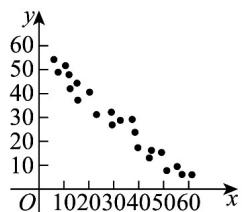

<!-- question-source:start -->
1. 对四组数据进行统计，获得如图散点图，其中线性相关性比较强且负相关的是（）

图①(相关系数 $r_{1}$ )

图②(相关系数 $r_{2}$ )

图③(相关系数 $r_{3}$ )

图④(相关系数 $r_{4}$ )

A. $r_1$ B. $r_2$ C. $r_3$ D. $r_4$
<!-- question-source:end -->

![[高中/课堂同步/题库/人教A版高中数学同步讲义(2026)/05_选择性必修第三册/第八章 成对数据的统计分析/讲义/第八章_成对数据的统计分析_高效培优讲义_数学人教A版高二选择性必修第/即学即练_sec_03/questions/answers/Q00059985A1.md]]
