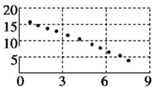
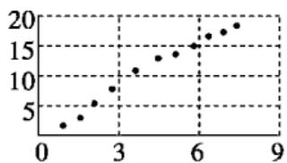
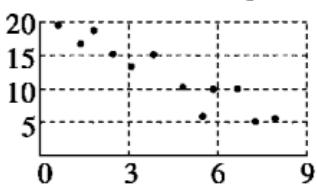

<!-- question-source:start -->
2.（多选）对四组数据进行统计，获得如图所示的散点图，关于其相关系数的关系，正确的有（）

相关系数 $r_{1}$

相关系数 $r_{3}$

相关系数 $r_{2}$

相关系数 $r_{4}$

A. $r_1 < r_4$ B. $r_2 < r_3$ C. $r_3 > 0$ D. $r_4 > 0$
<!-- question-source:end -->

![[高中/课堂同步/题库/人教A版高中数学同步讲义(2026)/05_选择性必修第三册/第八章 成对数据的统计分析/讲义/第八章_成对数据的统计分析_高效培优讲义_数学人教A版高二选择性必修第/即学即练_sec_03/questions/answers/Q00059986A1.md]]
