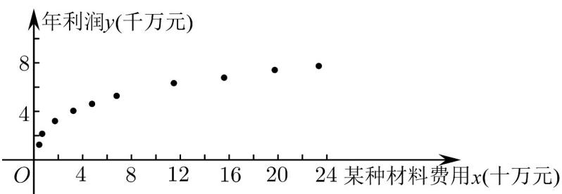

<!-- question-source:start -->
2. 某生产制造企业统计了近 $^{10}$ 年的年利润 $y$ （千万元）与每年投入的某种材料费用 $x$ （十万元）的相关数

据，作出如下散点图：

选取函数 $y = a \cdot x^{b} (b > 0, a > 0)$ 作为每年该材料费用 $x$ 和年利润 $y$ 的回归模型·若令

$m = \ln x, n = \ln y, m_i = \ln x_i, n_i = \ln y_i$ ，则 $n = bm + \ln a$ ，得到相关数据如表所示：

<table><tr><td> $\sum_{i=1}^{10}m_{i}n_{i}$ </td><td> $\sum_{i=1}^{10}m_{i}$ </td><td> $\sum_{i=1}^{10}n_{i}$ </td><td> $\sum_{i=1}^{10}m_{i}^{2}$ </td></tr><tr><td>31.5</td><td>15</td><td>15</td><td>49.5</td></tr></table>

(1)求出 $y$ 与 $x$ 的回归方程；

(2)计划明年年利润额突破 $^{1}$ 亿，则该种材料应至少投入多少费用？（结果保留到万元）参考数据：

$$
\frac {1 0}{e} \approx 3. 6 7 9, 3. 6 7 9 ^ {2} \approx 1 3. 5 3 5, 3. 6 7 9 ^ {3} \approx 4 9. 7 9 5.
$$
<!-- question-source:end -->

![[高中/课堂同步/题库/人教A版高中数学同步讲义(2026)/05_选择性必修第三册/第八章 成对数据的统计分析/讲义/第八章_成对数据的统计分析_高效培优讲义_数学人教A版高二选择性必修第/即学即练_sec_06/questions/answers/Q00059988A1.md]]
