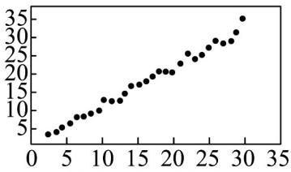
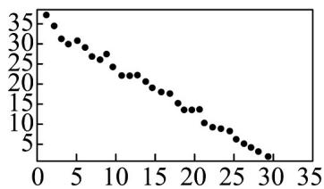
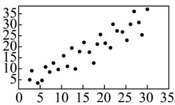
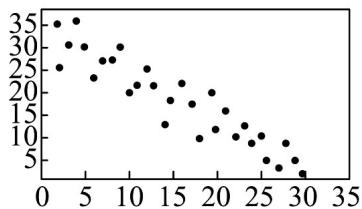

<!-- question-source:start -->
3. 对四组数据进行统计，获得以下散点图，关于其相关系数的比较，正确的是（）

样本相关系数为 $r_1$

样本相关系数为 $r_2$

样本相关系数为 $r_{3}$ 样本相关系数为 $r_{4}$ A. $r_{2}<r_{4}<0<r_{3}<r_{1}$ B. $r_{4}<r_{2}<0<r_{1}<r_{3}$ C. $r_{4}<r_{2}<0<r_{3}<r_{1}$ D. $r_{2}<r_{4}<0<r_{1}<r_{3}$
<!-- question-source:end -->

![[高中/课堂同步/题库/人教A版高中数学同步讲义(2026)/05_选择性必修第三册/第八章 成对数据的统计分析/讲义/第八章_成对数据的统计分析_高效培优讲义_数学人教A版高二选择性必修第/强化训练_sec_14/questions/answers/Q00060007A1.md]]
