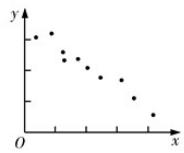

## 知识点 01 变量间的相关关系

## 1、变量之间的相关关系

当自变量取值一定时，因变量的取值带有一定的随机性，则这两个变量之间的关系叫相关关系．由于相关关

系的不确定性，在寻找变量之间相关关系的过程中，统计发挥着非常重要的作用．我们可以通过收集大量的

数据，在对数据进行统计分析的基础上，发现其中的规律，对它们的关系作出判断。

注意：相关关系与函数关系是不同的，相关关系是一种非确定的关系，函数关系是一种确定的关系，而且函

数关系是一种因果关系，但相关关系不一定是因果关系，也可能是伴随关系。

2、散点图

将样本中的 n 个数据点 $(x_{i}, y_{i})(i = 1, 2, \cdots, n)$ 描在平面直角坐标系中，所得图形叫做散点图．根据散点图中点的

分布可以直观地判断两个变量之间的关系.

(1) 如果散点图中的点散布在从左下角到右上角的区域内，对于两个变量的这种相关关系，我们将它称为正

相关，如图（1）所示；

(2) 如果散点图中的点散布在从左上角到右下角的区域内，对于两个变量的这种相关关系，我们将它称为负

相关，如图（2）所示。

(1)

(2)

## 3、相关系数

若相应于变量 $x$ 的取值 $x_{i}$ ，变量 $y$ 的观测值为 $y_{i}(1\leq i\leq n)$ ，则变量 $x$ 与 $y$ 的相关系数

$r=\frac{\sum_{i=1}^{n}(x_{i}-\bar{x})(y_{i}-\bar{y})}{\sqrt{\sum_{i=1}^{n}(x_{i}-\bar{x})^{2}\sum_{i=1}^{n}(y_{i}-\bar{y})^{2}}}=\frac{\sum_{i=1}^{n}x_{i}y_{i}-nx\bar{y}}{\sqrt{\sum_{i=1}^{n}x_{i}^{2}-nx^{\bar{2}}}\sqrt{\sum_{i=1}^{n}y_{i}^{2}-ny^{\bar{2}}}}$ ，通常用来衡量与之间的线性关系的强弱，

的范围为 $-1 \leq r \leq 1$

(1) 当 $r > 0$ 时，表示两个变量正相关；当 $r < 0$ 时，表示两个变量负相关。

(2) $|r|$ 越接近1，表示两个变量的线性相关性越强； $|r|$ 越接近0，表示两个变量间几乎不存在线性相关关系．当 $|r|=1$ 时，所有数据点都在一条直线上．

(3) 通常当 $|r| > 0.75$ 时，认为两个变量具有很强的线性相关关系。
