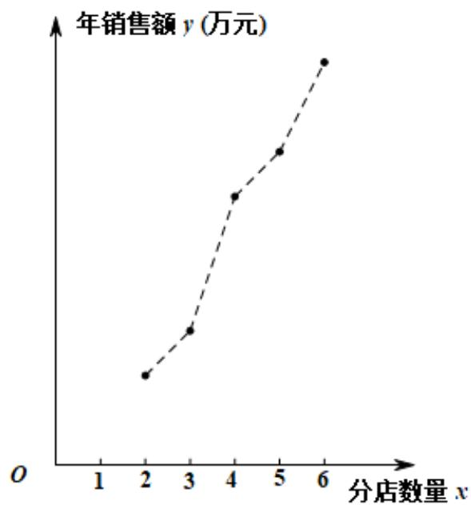

## 知识点 02 线性回归

## 1、线性回归

线性回归是研究不具备确定的函数关系的两个变量之间的关系（相关关系）的方法.

对于一组具有线性相关关系的数据（x1，y1），（x2，y2），…，（xn，yn），其回归方程 $\hat{y} = \hat{b} x + \hat{a}$ 的求法

为

$$
\left\{ \begin{array}{l} \hat {b} = \frac {\sum_ {i = 1} ^ {n} \left(x _ {i} - \bar {x}\right) \left(y _ {i} - \bar {y}\right)}{\sum_ {i = 1} ^ {n} \left(x _ {i} - \bar {x}\right) ^ {2}} = \frac {\sum_ {i = 1} ^ {n} x _ {i} y _ {i} - n \bar {x} \bar {y}}{\sum_ {i = 1} ^ {n} x _ {i} ^ {2} - n \bar {x} ^ {2}} \\ \hat {a} = \bar {y} - \hat {b} \bar {x} \end{array} \right.
$$

其中， $\overline{x}=\frac{1}{n}\sum_{i=1}^{n}x_{i}$ ， $\overline{y}=\frac{1}{n}\sum_{i=1}^{n}y_{i}$ ， $(\overline{x},\overline{y})$ 称为样本点的中心。

## 2、残差分析

对于预报变量 $y$ ，通过观测得到的数据称为观测值 $y_{i}$ ，通过回归方程得到的 $\hat{y}$ 称为预测值，观测值减去预测

值等于残差， $\hat{e}_i$ 称为相应于点 $(x_i, y_i)$ 的残差，即有 $\hat{e}_i = y_i - \hat{y}_i$ 。残差是随机误差的估计结果，通过对残差的

分析可以判断模型刻画数据的效果以及判断原始数据中是否存在可疑数据等，这方面工作称为残差分析。

(1) 残差图

通过残差分析，残差点 $(x_{i},\hat{e}_{i})$ 比较均匀地落在水平的带状区域中，说明选用的模型比较合适，其中这样的带

状区域的宽度越窄，说明模型拟合精确度越高；反之，不合适。

(2) 通过残差平方和 $Q = \sum_{i=1}^{n} (y_i - \hat{y}_i)^2$ 分析，如果残差平方和越小，则说明选用的模型的拟合效果越好；反之，不合适。

(3) 相关指数

用相关指数来刻画回归的效果，其计算公式是： $R^2 = 1 - \frac{\sum_{i=1}^{n}(y_i - \hat{y}_i)^2}{\sum_{i=1}^{n}(y_i - \overline{y})^2}$ $R^2$ 越接近于1，说明残差的平方和越小，也表示回归的效果越好.

【即学即练】

1. 下列命题错误的是（ ）
A．两个随机变量的线性相关性越强，相关系数的绝对值越接近于 $^{1}$ B．设 $\xi \sim N(1, \sigma^{2})$ ，且 $P(\xi < 0) = 0.2$ ，则 $P(1 < \xi < 2) = 0.2$ C．线性回归直线 $\hat{y}=bx+a$ 一定经过样本点的中心 $(\overline{x},\overline{y})$ D．在残差图中，残差点分布的带状区域的宽带越狭窄，其模型拟合的精度越高

【答案】B

【分析】利用相关关系判断 $^{A}$ ；由正态分布的性质判断 $^{B}$ ；由线性回归直线的性质判断 $^{C}$ ；由残差的性质判断D.

【详解】对于 $^{A}$ ，根据相关系数的意义可知， $^{A}$ 正确；

对于 B，由 $\xi\sim N(1,\sigma^{2})$ ，知 $\mu=1$ ，即概率密度函数的图像关于直线 x=1 对称，所以 $P(\xi<0)=P(\xi>2)=0.2$

则 $P(1 < \xi < 2) = \frac{1 - 2P(\xi < 0)}{2} = 0.3$ ，故B错误；

对于 $^{C}$ ，根据线性回归直线的性质可知， $^{C}$ 正确；

对于 D，根据残差图的意义可知，D 正确；

2. 随着互联网行业、传统行业和实体经济的融合不断加深，互联网对社会经济发展的推动效果日益显著，某

大型超市计划在不同的线上销售平台开设网店，为确定开设网店的数量，该超市在对网络上相关店铺做了充

分的调查后，得到下列信息，如图所示（其中 $x$ 表示开设网店数量， $y$ 表示这 $x$ 个分店的年销售额总和），

现已知 $\sum_{i=1}^{5} x_i y_i = 8850, \sum_{i=1}^{5} y_i = 2000$ ，求解下列问题；

(1) 经判断，可利用线性回归模型拟合 $y$ 与 $x$ 的关系，求解 $y$ 关于 $x$ 的回归方程；

(2) 按照经验，超市每年在网上销售获得的总利润 $w$ （单位：万元）满足 $w = y - 5x^{2} - 140$ ，请根据（1）中

的线性回归方程，估算该超市在网上开设多少分店时，才能使得总利润最大。

参考公式；线性回归方程 $\hat{y} = \hat{b}x + \hat{a}$ ，其中 $\hat{a} = \overline{y} -\hat{b}\overline{x},b = \frac{\sum_{i = 1}^{5}x_iy_i - n\overline{xy}}{\sum_{i = 1}^{5}x_i^2 - n\overline{x}^2}$

【答案】（1） $\hat{y}=85x+60$ ；（2）开设 $^{8}$ 或 $^{9}$ 个分店时，才能使得总利润最大。

【分析】（1）先求得 $\sum_{i=1}^{5} x_i^2 = 90, \overline{x} = 4$ ，再根据提供的数据求得 $\hat{b}$ ， $\hat{a}$ ，写出回归直线方程；

(2) 由 (1) 结合 $w = y - 5x^{2} - 140$ ，得到 $w = -5x^{2} + 85x - 80$ ，再利用二次函数的性质求解

【详解】（1）由题意得 $\sum_{i=1}^{5} x_i^2 = 90, \overline{x} = 4, \hat{b} = \frac{8850 - 20 \times 400}{90 - 80} = 85$

$$
\hat {a} = 4 0 0 - 8 5 \times 4 = 6 0,
$$

所以 $\hat{y} = 85x + 60$

(2) 由 (1) 知， $w = -5x^{2} + 85x - 80 = -5\left(x - \frac{17}{2}\right)^{2} + \frac{1125}{4}$

所以当 $x = 8$ 或 $x = 9$ 时能获得总利润最大.
