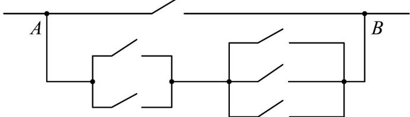

<!-- question-source:start -->
38. 如图，要让电路从 $A$ 处到 $B$ 处只有一条支路接通，则不同的路径有（）

The Ground Truth image displays a single, solid horizontal line, which is a stylistic or background element (like a ruled paper line or separator), not a placeholder for text. According to Rule 2, such stylistic/background lines must be ignored by the OCR result. The OCR content provided is "", which consists of no characters. This correctly represents the absence of any textual content in the GT and correctly matches the visual line as a stylistic element. Therefore, the OCR output should have been empty or omitted this line entirely.

A.5种 B.6种 C.7种 D.9种
<!-- question-source:end -->

![[高中/课堂同步/题库/人教A版高中数学同步讲义(2026)/05_选择性必修第三册/第六章 计数原理/专项训练/专题01分类加法计数原理与分步乘法计数原理的四大常考题型_高效培优专项/题型四_分类与分步原理综合考察/questions/answers/Q00057228A1.md]]
