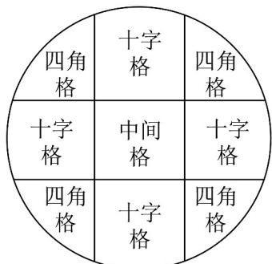

> [!faq]- 《专题01分类加法计数原理与分步乘法计数原理的四大常考题型_高效培优专项》官方解析
>
> > [!success]- **【答案】** C
>
> > [!note]- **【分析】**
> > 利用分类加法计数原理以及分步乘法计数原理，可得答案
>
> > [!note]- **【解析】**
> > 由分类加法计数原理以及分步乘法计数原理可知，不同的路径有 $1 + 2 \times 3 = 7$ 种.
> > 故选：C.
> >
> > 39．重庆九宫格火锅，是重庆火锅独特的烹饪方式·九宫格下面是相通的，实现了“底同火不同，汤通油不通”它把火锅分为三个层次，不同的格子代表不同的温度和不同的牛油浓度，其锅具抽象成数学形状如图（同一类格子形状相同）：
> >
> > “中间格”火力旺盛，不宜久煮，适合放一些质地嫩脆、顷刻即熟的食物；
> >
> > “四角格”属文火，火力温和，适合焖菜，让食物软糯入味。现有 $^{6}$ 种不同食物（足够量），其中 $^{1}$ 种适合放入中间格， $^{3}$ 种适合放入十字格， $^{2}$ 种适合放入四角格。现将九宫格全部放入食物，且每格只放一种，若同时可以吃到这六种食物（不考虑位置），则有多少种不同放法（）
> >
> > 
> >
> > A.108 B.36 C.9 D.6
> >
> > 【答案】C
> > 【分析】利用分步计数原理及分类计数原理即得
> > 【详解】由题可知中间格只有一种放法；十字格有四个位置，3种适合放入，所以有一种放两个位置，共有3种放法；四角格有四个位置，2种适合放入，可分为一种放三个位置，另一种放一个位置，有2种放法，或每种都放两个位置，有1种放法，故四角格共有3种放法；
> >
> > 所以不同放法共有 $1 \times 3 \times 3 = 9$ 种.
> >
> > 故选 **C**.
