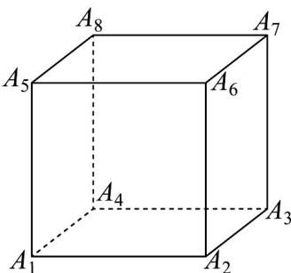

<!-- question-source:start -->
14. 如图，已知正方体 $A_{1}A_{2}A_{3}A_{4}-A_{5}A_{6}A_{7}A_{8}$ ，空间中一点 $P$ 满足 $\overline{A_{1}P}=x\overline{A_{1}}\overline{A_{2}}+y\overline{A_{1}}\overline{A_{4}}+z\overline{A_{1}}\overline{A_{5}}$ ，且 $x+y+z=1$ ，当 $\left|\overline{A_{1}P}\right|$ 取最小值时，点 $P$ 位置记为点 $Q$ ，则数量积 $\overline{A_{1}Q}\cdot\overline{A_{1}}\overline{A_{k}}(1<k\leq8,k\in\mathbb{N})$ 的不同取值的个数为\_\_\_\_。

<!-- question-source:end -->

![[高中/课堂同步/题库/人教A版高中数学同步讲义(2026)/05_选择性必修第三册/第六章 计数原理/专项训练/专题02_两个计数原理综合应用的四大常考题型_高效培优专项训练_/题型一/questions/answers/Q00058836A1.md]]
