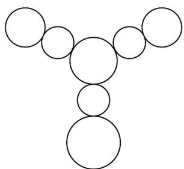

<!-- question-source:start -->
33. 如图所示的挂件由 7 个圆组成，中心圆为主挂件，从中心向三个方向延伸出分挂件，每个方向有两个分挂件，靠近主挂件的为第一层分挂件，远离主挂件的为第二层分挂件。现用四种不同的颜色给所有的挂件涂色，要求相邻的挂件涂不同的颜色，且同一层的分挂件涂不同的颜色，则所有的涂色方法种数为（）

A.54 B.154 C.264 D.286
<!-- question-source:end -->

![[高中/课堂同步/题库/人教A版高中数学同步讲义(2026)/05_选择性必修第三册/第六章 计数原理/专项训练/专题02_两个计数原理综合应用的四大常考题型_高效培优专项训练_/题型四/questions/answers/Q00058849A1.md]]
