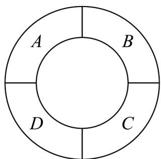

<!-- question-source:start -->
34．如图，一个环形的花坛被分成了编号为 A、B、C、D 的四个区域，现有 $^{4}$ 种不同的种子，要求同一区域种植同一种种子，且相邻区域种植的种子不同，则共有（）种不同的种植方法．

A 36 B 60 C 84 D 120
<!-- question-source:end -->

![[高中/课堂同步/题库/人教A版高中数学同步讲义(2026)/05_选择性必修第三册/第六章 计数原理/专项训练/专题02_两个计数原理综合应用的四大常考题型_高效培优专项训练_/题型四/questions/answers/Q00058850A1.md]]
