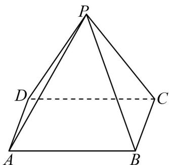

<!-- question-source:start -->
36. 如图所示，现要给固定位置的四棱锥 $P - ABCD$ 的五个面涂上颜色，要求相邻的面涂不同的颜色，可供选择的颜色共有 $^5$ 种，则不同的涂色方案共有（）

A. 360 B. 420 C. 480 D. 660
<!-- question-source:end -->

![[高中/课堂同步/题库/人教A版高中数学同步讲义(2026)/05_选择性必修第三册/第六章 计数原理/专项训练/专题02_两个计数原理综合应用的四大常考题型_高效培优专项训练_/题型四/questions/answers/Q00058852A1.md]]
