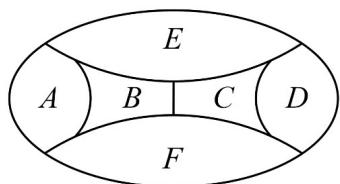

<!-- question-source:start -->
38. 用四种颜色给下图的 $^{6}$ 个区域涂色，每个区域涂一种颜色，相邻区域不同色，共有多少种不同的涂法（）

A. 72 B. 96 C. 120 D. 144
<!-- question-source:end -->

![[高中/课堂同步/题库/人教A版高中数学同步讲义(2026)/05_选择性必修第三册/第六章 计数原理/专项训练/专题02_两个计数原理综合应用的四大常考题型_高效培优专项训练_/题型四/questions/answers/Q00058854A1.md]]
