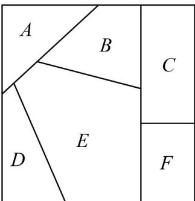

## 题型四：涂色问题

31. 给如图所示的六块区域 $A, B, C, D, E, F$ 涂色，有四种不同的颜色可供选择（不一定每种颜色都要使用），要求相邻区域涂不同颜色，则不同的涂色方法种数是（）

A. 192 B. 168 C. 224 D. 208

【答案】A

【分析】利用分步乘法计数：先给 B，C，E 三块区域涂色，再给 F 区域涂色，然后给 A 区域涂色，最后给 D 区域涂色，即可求解.

【详解】第一步，给 B，C，E 三块区域涂色，有 $A_{4}^{3}$ 种涂色方法；

第二步，给 F 区域涂色，有 2 种涂色方法；

第三步，给 A 区域涂色，有 2 种涂色方法；

第四步，给 D 区域涂色，有 2 种涂色方法，

综上，不同的涂色方法种数是 $A_{4}^{3} \times 2 \times 2 \times 2 = 192$ ，故 A 正确.

故选：A.

![[高中/课堂同步/题库/人教A版高中数学同步讲义(2026)/05_选择性必修第三册/第六章 计数原理/专项训练/专题02_两个计数原理综合应用的四大常考题型_高效培优专项训练_/题型四/questions/Q00058848.md]]
![[高中/课堂同步/题库/人教A版高中数学同步讲义(2026)/05_选择性必修第三册/第六章 计数原理/专项训练/专题02_两个计数原理综合应用的四大常考题型_高效培优专项训练_/题型四/questions/Q00058849.md]]
![[高中/课堂同步/题库/人教A版高中数学同步讲义(2026)/05_选择性必修第三册/第六章 计数原理/专项训练/专题02_两个计数原理综合应用的四大常考题型_高效培优专项训练_/题型四/questions/Q00058850.md]]
![[高中/课堂同步/题库/人教A版高中数学同步讲义(2026)/05_选择性必修第三册/第六章 计数原理/专项训练/专题02_两个计数原理综合应用的四大常考题型_高效培优专项训练_/题型四/questions/Q00058851.md]]
![[高中/课堂同步/题库/人教A版高中数学同步讲义(2026)/05_选择性必修第三册/第六章 计数原理/专项训练/专题02_两个计数原理综合应用的四大常考题型_高效培优专项训练_/题型四/questions/Q00058852.md]]
![[高中/课堂同步/题库/人教A版高中数学同步讲义(2026)/05_选择性必修第三册/第六章 计数原理/专项训练/专题02_两个计数原理综合应用的四大常考题型_高效培优专项训练_/题型四/questions/Q00058853.md]]
![[高中/课堂同步/题库/人教A版高中数学同步讲义(2026)/05_选择性必修第三册/第六章 计数原理/专项训练/专题02_两个计数原理综合应用的四大常考题型_高效培优专项训练_/题型四/questions/Q00058854.md]]
![[高中/课堂同步/题库/人教A版高中数学同步讲义(2026)/05_选择性必修第三册/第六章 计数原理/专项训练/专题02_两个计数原理综合应用的四大常考题型_高效培优专项训练_/题型四/questions/Q00058855.md]]
