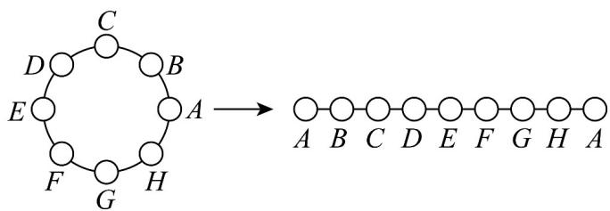

> [!faq]- 《专题03_排列六大常考题型_高效培优专项训练_》官方解析
>
> > [!success]- **【答案】** ACD
>
> > [!note]- **【分析】**
> > 利用阶乘、排列组合数公式作转化判断各选项正误·
>
> > [!note]- **【解析】**
> > A： $\frac{n!}{n(n-1)}=\frac{n(n-1)(n-2)\cdots\cdot1}{n(n-1)}=(n-2)!$ ，正确；
> >
> > B : $A_{n}^{m}=\frac{n!}{(n-m)!}\neq\frac{n!}{m!}$ ，错误；
> >
> > C : $(n+1)A_{n}^{m}=\frac{(n+1)\cdot n!}{(n-m)!}=\frac{(n+1)!}{[n+1-(m+1)]!}=A_{n+1}^{m+1}$ ，正确；
> >
> > D : $mC_{n}^{m}=\frac{m\cdot n!}{m!(n-m)!}=\frac{n\cdot(n-1)!}{(m-1)![(n-1)-(m-1)]!}=nC_{n-1}^{m-1}$ ，正确；
> >
> > 故选：ACD
> >
> > 题型三：全排列问题
> >
> > 17. 8人围绕圆桌而坐，共有多少种坐法？
> >
> > 【答案】5040种
> >
> > 【分析】将圆桌而坐的问题转化为坐成一排的问题，再利用全排列即可·
> >
> > 【详解】围桌而坐与坐成一排的不同点在于，坐成圆形没有首尾之分，如图 $^{4}$ 所示，所以固定一人，并从此位置把圆形展成直线其余 $^{7}$ 人共有 $(8-1)!$ 种排法，即 $^{5040}$ 种。
> >
> > 
> > 答图4
