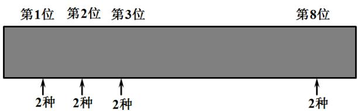

> [!faq]- 《专题01 分类加法计数原理与分步乘法计数原理的四大常考题型（高效培优专项训练）》官方解析
>
> > [!success]- **【答案】** A. 12 B. 24 C. 64 D. 81
>
> > [!note]- **【分析】**
> > 根据题意，可知三个同学中每人有 $^{4}$ 种报名方法，由分步计数原理即可得到
>
> > [!note]- **【解析】**
> > 甲、乙、丙三个同学报名参加学校运动会中设立的跳高、铅球、跳远、 $^{100}$ 米比赛，每人限报一项，每人有 $^{4}$ 种报名方法，
> >
> > 根据分步计数原理，可知共有 $4 \times 4 \times 4 = 64$ 种不同的报名方法。
> >
> > 故选：C
> >
> > 8. 电子元件很容易实现电路的通与断、电位的高与低等两种状态，而这也是最容易控制的两种状态·因此计算机内部就采用了每一位只有0或1两种数字的记数法，即二进制·为了使计算机能够识别字符，需要对字符进行编码，每个字符可以用一个或多个字节来表示，其中字节是计算机中数据存储的最小计量单位，每个字节由8个二进制位构成·问：
> >
> > 
> >
> > (1) 一个字节(8位)最多可以表示多少个不同的字符？
> >
> > (2) 计算机汉字国标码 $(GB$ 码)包含了6763个汉字，一个汉字为一个字符，要对这些汉字进行编码，每个汉字至少要用多少个字节表示？
> >
> > 【答案】 $(1)^{256}$ 个； $(2)^{2}$ 个.
> >
> > 【解析】（1）一个字节共有8位，每位上有2种选择，根据分步乘法计数原理，即可得解；
> >
> > (2) 由 (1) 知，用一个字节能表示 $256$ 个字符，不够表示，继续利用分步相乘原理计算 2 个字节可以表示的不同的字符，判断与 $6763$ 的大小关系即可.
> >
> > 【详解】（1）一个字节共有8位，每位上有2种选择，
> >
> > 根据分步乘法计数原理，一个字节最多可以表示 $2^{8} = 256$ 个不同的字符；
> >
> > (2) 由 (1) 知，用一个字节能表示 256 个字符，Q256 < 6763，∴ 一个字节不够；
> >
> > 根据分步乘法计数原理，2个字节可以表示 $256 \times 256 = 65536$ 个不同的字符，
> >
> > Q65536 > 6763，所以每个汉字至少要用2个字节表示·
>
> > [!tip]- **【名师点睛】**
> > 关键点点睛：本题考查分步乘法计数原理，熟练掌握分步计数原理的概念及计算公式是解题的关键，考查学生的逻辑思维与运算能力，属于基础题·
