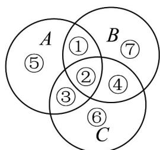

> [!faq]- 《专题01 分类加法计数原理与分步乘法计数原理的四大常考题型（高效培优专项训练）》官方解析
>
> > [!success]- **【答案】** 1600
>
> > [!note]- **【分析】**
> > 如图，问题等价于 $^{6}$ 个不同的元素按要求放置到七块区域的不同方法种数，利用分步乘法原理计算得解：
>
> > [!note]- **【解析】**
> > 将 $A \cup B \cup C$ 分为编号分别为①②③④⑤⑥⑦的七块区域，如图所示，
> >
> > 问题等价于 $^{6}$ 个不同的元素按要求放置到七块区域的不同方法种数。
> >
> > 
> >
> > 由条件知，元素 $^{1}$ ， $^{2}$ 必在区域①或②，各有 $^{2}$ 种放法；元素 $^{3}$ ， $^{4}$ 必在③或④或⑥或⑦区域，各有 $^{4}$ 种方法；
> >
> > 元素 $^{5}$ ， $^{6}$ 必在③或④或⑤或⑥或⑦区域，各有 $^{5}$ 种方法·
> >
> > 根据分步乘法计数原理，共有 $2 \times 2 \times 4 \times 4 \times 5 \times 5 = 1600$ 种.
> >
> > 故答案为：1600.
