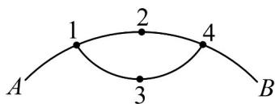

> [!faq]- 《专题01 分类加法计数原理与分步乘法计数原理的四大常考题型（高效培优专项训练）》官方解析
>
> > [!success]- **【答案】**  A. 11 B. 13 C. 15 D. 17
>
> > [!note]- **【分析】**
> > 按照焊接点脱落的个数分类讨论，运用分类加法计数原理求解即可·
>
> > [!note]- **【解析】**
> > 按照焊接点脱落的个数分类讨论，若脱落 $^{1}$ 个，则有 $\{1\},\{4\}$ 共 $^{2}$ 种情况，
> >
> > 若脱落 $^{2}$ 个，则有 $\{1,2\},\{1,3\},\{1,4\},\{2,3\},\{2,4\},\{3,4\}$ 共6种情况，
> >
> > 若脱落 $^{3}$ 个，则有 $\{1,2,3\},\{1,2,4\},\{2,3,4\},\{1,3,4\}$ 共 $^{4}$ 种情况，
> >
> > 若脱落 $^{4}$ 个，则有 $\{1,2,3,4\}$ 共 $^{1}$ 种情况，
> >
> > 由分类加法计数原理，情况种数共有 $2 + 6 + 4 + 1 = 13$ 种.
> >
> > 故选 **B**.
