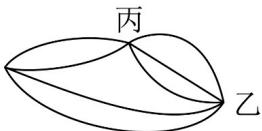

> [!faq]- 《专题01 分类加法计数原理与分步乘法计数原理的四大常考题型（高效培优专项训练）》官方解析
>
> > [!success]- **【答案】**  A.5 B.6 C.7 D.8
>
> > [!note]- **【分析】**
> > 根据分类加法计数原理和分步乘法计数原理即可求解
>
> > [!note]- **【解析】**
> > 由分步乘法计数原理可知：从甲地经过丙地到乙地共有 $2 \times 3 = 6$ 种走法；又从甲地不经过丙地到乙地有 $^2$ 条水路可走，
> > 所以根据分类加法计数原理可得：从甲地到乙地的走法种数为 $6 + 2 = 8$ .
> >
> > 故选 **D**.
