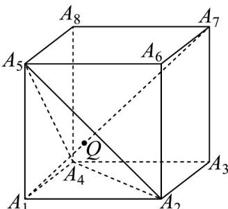

> [!faq]- 《专题02 两个计数原理综合应用的四大常考题型（高效培优专项训练）》官方解析
>
> > [!success]- **【答案】** 
>
> > [!note]- **【分析】**
> > 根据向量共面的推论易知 P 在面 $A_{2}A_{4}A_{5}$ 内，且 $A_{1}Q \perp$ 面 $A_{2}A_{4}A_{5}$ ，结合正方体的对称性及空间数量积运算确定不同取值的个数.
>
> > [!note]- **【解析】**
> > 由 $A_{1}P = xA_{1}A_{2} + yA_{1}A_{4} + zA_{1}A_{5}$ ，且 $x + y + z = 1$ ，即 $P$ 在面 $A_{2}A_{4}A_{5}$ 内，
> >
> > 要使 $\left|A_{1}P\right|$ 取最小值时，点P位置记为点Q，即 $A_{1}Q\perp$ 面 $A_{2}A_{4}A_{5}$ ，结合正方体的对称性，
> >
> > 知： $A_{1}Q\cdot A_{1}A_{2} = A_{1}Q\cdot A_{1}A_{4} = A_{1}Q\cdot A_{1}A_{5}$ ， $A_{1}Q\cdot A_{1}A_{3} = A_{1}Q\cdot A_{1}A_{6} = A_{1}Q\cdot A_{1}A_{8}$ ， $A_{1}Q\cdot A_{1}A_{7}$ 三种情况，
> >
> > 所以数量积 $A_{1}Q \cdot A_{1}A_{k} (1 < k \leq 8, k \in \mathbb{N})$ 的不同取值的个数为 3.
> >
> > 故答案为：3
> >
> > 
