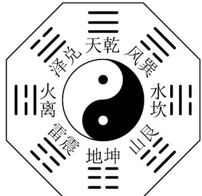
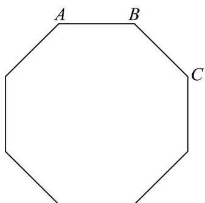

> [!faq]- 《专题02 两个计数原理综合应用的四大常考题型（高效培优专项训练）》官方解析
>
> > [!success]- **【答案】** 20
>
> > [!note]- **【分析】**
> > 根据已知有 $a^2 + b^2 = 25$ ，结合 $a, b$ 的取值判断满足条件的点 $P$ ，即可得答案
>
> > [!note]- **【解析】**
> > 由题设 $\sqrt{a^{2}+b^{2}}$ $5\Rightarrow a^{2}+b^{2}$ 25，又 a,b 都是集合 $\{1,2,3,4,5,6\}$ 中的元素，且 $a\neq b$
> >
> > 所以，满足要求的点 $P(a,b)$ 有 $(1,5)$ 、 $(1,6)$ 、 $(2,5)$ 、 $(2,6)$ 、 $(3,4)$ 、 $(3,5)$ 、 $(3,6)$ 、 $(4,3)$ 、 $(4,5)$ 、 $(4,6)$ 、 $(5,1)$ 、 $(5,2)$ 、 $(5,3)$ 、 $(5,4)$ 、 $(5,6)$ 、 $(6,1)$ 、 $(6,2)$ 、 $(6,3)$ 、 $(6,4)$ 、 $(6,5)$ ，
> >
> > 所以这样的点 P 有 20 个.
> >
> > 故答案为：20
> >
> > 16. 古代中国的太极八卦图是以同圆内的圆心为界，画出形状相同的两个阴阳鱼，阳鱼的头部有个阴眼，阴鱼的头部有个阳眼，表示万物都在相互转化，互相渗透，阴中有阳，阳中有阴，阴阳相合，相生相克，蕴含现代哲学中的矛盾对立统一规律。由八卦模型图可抽象得到正八边形，从该正八边形的 $^{8}$ 个顶点中任意取出 $^{4}$ 个构成四边形，其中梯形的个数为\_\_\_\_。
> >
> > 【答案】
> >
> > 
> >
> > 【答案】24
> >
> > 【分析】首先分情况，先确定两个顶点，再确定其他顶点，即可求解·
> >
> > 【详解】梯形的上、下底平行且不相等，如图，
> >
> > 
> >
> > 若以 $AB$ 为底边，则可构成 $^2$ 个梯形，根据对称性可知此类梯形有 $2 \times 8 = 16$ （个），
> >
> > 若以 AC 为底边，则可构成 $^{1}$ 个梯形，此类梯形共有 $1 \times 8 = 8$ （个），
> >
> > 所以梯形的个数是 $16+8=24$ （个）.
> >
> > 故答案为：24
