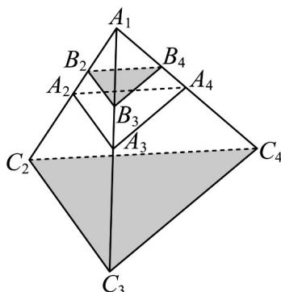
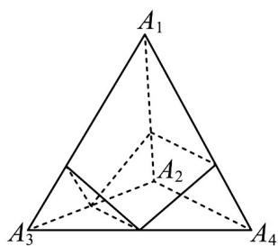

> [!faq]- 《专题02 两个计数原理综合应用的四大常考题型（高效培优专项训练）》官方解析
>
> > [!success]- **【答案】** A. 2 B. 5 C. 8 D. 9
>
> > [!note]- **【分析】**
> > 分两种情况： $\alpha$ 与平面 $A_{2}A_{3}A_{4}$ 平行、 $\alpha$ 经过 $\triangle A_{2}A_{3}A_{4}$ 中位线分别求出它们满足要求的 $\alpha$ 个数，加总即可·
>
> > [!note]- **【解析】**
> > 当 $\alpha$ 与平面 $A_{2}A_{3}A_{4}$ 平行时，如下图存在 2 种情况：
> >
> > 
> >
> > 当 $\alpha$ 经过 $\triangle A_{2}A_{3}A_{4}$ 中位线时，如下图其中一条中位线有 $^{2}$ 种情况，故三条中位线，共有 $^{6}$ 种情况.
> >
> > 
> >
> > 综上，共有 $2 + 6 = 8$ 种情况·
> >
> > 故选 **C**.
