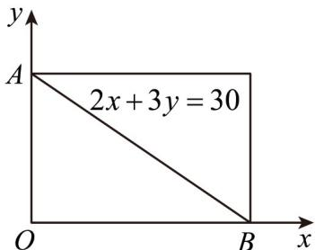
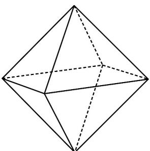

> [!faq]- 《专题02 两个计数原理综合应用的四大常考题型（高效培优专项训练）》官方解析
>
> > [!success]- **【答案】** B
>
> > [!note]- **【分析】**
> > 首先确定以 AB 为对角线的矩形中整点的个数，再确定 $2x + 3y = 30$ 上的整点数，最后根据对称性求出 $\triangle AOB$ 中整点的个数.
>
> > [!note]- **【解析】**
> > 由题设，直线 $2x + 3y = 30$ 分别交 x、y 轴于 $(15,0)$ 、 $(0,10)$ ，
> >
> > 
> >
> > 以高为 $^{10}$ ，宽为 $^{15}$ 的矩形内（含边）整数点有 $^{176}$ 个，其中直线 $2x + 3y = 30$ 上的整数点有 $(15,0)$ 、 $(12,2)$ 、 $(9,4)$ 、 $(6,6)$ 、 $(3,8)$ 、 $(0,10)$ ，共 $^{6}$ 个，
> >
> > 所以，矩形对角线 $_{AB}$ 两侧的三角形中整点的个数为 $\frac{176 - 6}{2} = 85$ 个，
> >
> > 综上， $\triangle AOB$ 中整点的个数为 $85 + 6 = 91$ 个.
> >
> > 故选：B
> >
> > 20. 连接正方体每个面的中心构成一个正八面体。甲随机选择此正八面体的三个顶点构成三角形，乙随机选择此正八面体三个面的中心构成三角形，且甲、乙的选择互不影响，则（）
> >
> > 【答案】
> >
> > 
> >
> > A. 甲选择的三个点构成正三角形的概率为 $\frac{2}{5}$
> >
> > B. 甲选择的三个点构成等腰直角三角形的概率为 $\frac{2}{5}$ C. 乙选择的三个点构成正三角形的概率为 $\frac{1}{7}$ D. 甲选择的三个点构成的三角形与乙选择的三个点构成的三角形相似的概率为 $\frac{11}{35}$
> >
> > 【答案】ACD
> >
> > 【分析】利用古典概型的概率公式分别求出四个选项中的概率，即可判断得到答案
> >
> > 【详解】甲随机选择的情况有 $C_6^3 = 20$ 种，乙随机选择的情况有 $C_8^3 = 56$ 种，
> >
> > 对于 A：甲选择的三个点构成正三角形，只有一种情况：
> >
> > 甲从上下两个点中选一个，从中间四个点中选相邻两个，共有 $C_2^1 C_4^1 = 8$ 种，
> >
> > 故甲选择的三个点构成正三角形的概率为 $\frac{8}{20} = \frac{2}{5}$ ，故选项A正确；
> >
> > 对于 B：甲选择的三个点构成等腰直角三角形，有三种情况：
> > - **①**：上下两点都选，中间四个点中选一个，共有 $C_4^1 = 4$ 种；
> > - **②**：上下两点中选一个，中间四个点中选相对的两个点，共有 $C_{2}^{1}C_{2}^{1}=4$ 种；
> > - **③**：中间四个点中选三个点，共有 $C_{4}^{3}=4$ 种，故共有 $4+4+4=12$ 种，
> >
> > 所以甲选择的三个点构成等腰直角三角形的概率为 $\frac{12}{20} = \frac{3}{5}$ ，故选项 B 错误；
> >
> > 对于 $C$ ：乙选择的三个点构成正三角形，只有一种情况：上面四个面的中心中选一个点且从下面四个面的中心选相对的两个点，或下面四个面的中心中选一个点且从上面四个面的中心选相对的两个点，共有 $2\times 4 = 8$ 种，所以乙选择的三个点构成正三角形的概率为 $\frac{8}{56} = \frac{1}{7}$ ，故选项 $C$ 正确；
> >
> > 对于 D ：选择的三个点构成等腰直角三角形同上所求，共有 $8+16=24$ 种，概率为 $\frac{24}{56}=\frac{3}{7}$ ，甲乙相似，则甲乙均为正三角形或均为等腰直角三角形，所以甲选择的三个点构成的三角形与乙选择的三个点构成的三角形相似的概率为 $\frac{2}{5}\times\frac{1}{7}+\frac{3}{5}\times\frac{3}{7}=\frac{11}{35}$ ，故 D 选项正确.
> >
> > 故选 **ACD**.
