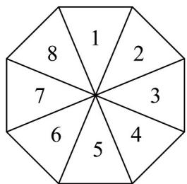
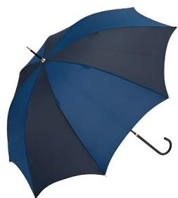

<!-- question-source:start -->
39. 如图所示的雨伞，其伞面被伞骨分成 $^{8}$ 个区域，每个区域分别印有数字 $^{1,2,3,\ldots,8}$ 。现准备给该伞面的每个区域涂色，要求每个区域涂一种颜色，相邻两个区域所涂颜色不能相同，对称的两个区域（如区域 $^{1}$ 与区域 $^{5}$ ）所涂颜色相同。若有 $^{6}$ 种不同颜色的颜料可供选择，则不同的涂色方案有\_\_\_\_种。

<!-- question-source:end -->

![[高中/课堂同步/题库/人教A版高中数学同步讲义(2026)/05_选择性必修第三册/第六章 计数原理/专题02 两个计数原理综合应用的四大常考题型（高效培优专项训练）/题型四_涂色问题/questions/answers/Q00083694A1.md]]
