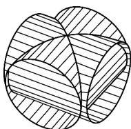
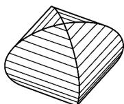

> [!faq]- 《专题02 两个计数原理综合应用的四大常考题型（高效培优专项训练）》官方解析
>
> > [!success]- **【答案】**  图(1)  图(2) A. 若 $n = 3$ ，不同的染色方法种数为6 B. 若 $n = 3$ ，不同的染色方法种数为12 C. 若 $n = 4$ ，不同的染色方法种数为60 D. 若 $n = 4$ ，不同的染色方法种数为84
>
> > [!note]- **【分析】**
> > 利用分步计数乘法原理与分类加法计数原理可求解·
>
> > [!note]- **【解析】**
> > 根据牟合方盖的表面可以看成四个曲面拼接成的·将一个牟合方盖的四个曲面编号为 $1,2,3,4$ ，故可转化为有公共点的 $4$ 个区域，如图所示：
> >
> > <table><tr><td>1</td><td>2</td></tr><tr><td>3</td><td>4</td></tr></table>
> >
> > n=3 时，若用两种颜色，则1号和 $^{4}$ 号区域同色，且2号和3号区域同色，有 $A_{3}^{2}=6$ 种不同的涂法，
> > 若用三种颜色，则要么1号和 $^{4}$ 号区域同色，要么2号和3号区域同色，有 $2\times A_{3}^{3}=12$ 种不同的涂法，
> > 共有18种不同的涂法，所以A错误，B错误.
> >
> > $n = 4$ 时， $^1$ 号区域可以从 $^4$ 种颜色的染料中任取一种涂色，有 $^4$ 种不同的涂法
> > - **①**：当 $^{2}$ 号， $^{3}$ 号区域涂不同颜色的染料时，有 $3\times2=6$ 种不同的涂法， $^{4}$ 号区域有 $^{2}$ 种不同的涂法，可知有 $4\times6\times2=48$ 种不同的涂法·
> > - **②**：当 $^{2}$ 号， $^{3}$ 号区域涂相同颜色的染料时，有 $^{3}$ 种不同的涂法， $^{4}$ 号区域也有 $^{3}$ 种不同的涂法，可知有 $4 \times 3 \times 3 = 36$ 种不同的涂法·
> >
> > 综上，由分类加法计数原理，可得共有 $48 + 36 = 84$ 种不同的涂法
> >
> > 因此，C 错误，D 正确·
> >
> > 故选 **D**
