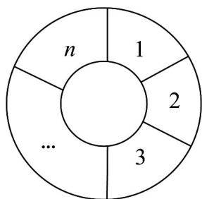

> [!faq]- 《专题02 两个计数原理综合应用的四大常考题型（高效培优专项训练）》官方解析
>
> > [!success]- **【答案】** 630
>
> > [!note]- **【分析】**
> > 由题知只需考虑区域 $^{1}$ ， $^{2}$ ， $^{3}$ ， $^{4}$ 的颜色即可，不妨先涂区域 $^{1}$ 、区域 $^{2}$ ，再分区域 $^{3}$ 与区域 $^{1}$ 涂的颜色不同及相同两种情况考虑即可求解·
>
> > [!note]- **【解析】**
> > 涂色问题 根据题意，只需确定区域 $^{1,2,3,4}$ 的颜色，即可确定整个伞面的涂色情况。
> >
> > 先涂区域 $^{1}$ ，有 $^{6}$ 种选择，再涂区域 $^{2}$ ，有 $^{5}$ 种选择，
> >
> > 当区域 $^{3}$ 与区域 $^{1}$ 涂的颜色不同时，区域 $^{3}$ 有 $^{4}$ 种选择，剩下的区域 $^{4}$ 有 $^{4}$ 种选择；
> >
> > 当区域 $^{3}$ 与区域 $^{1}$ 涂的颜色相同时，剩下的区域 $^{4}$ 有 $^{5}$ 种选择。
> >
> > 故不同的涂色方案有 $6 \times 5 \times (4 \times 4 + 5) = 630$ （种）.
> >
> > 故答案为：630.
> >
> > 40. 可将此类题型进行推广：将一个圆分成一个小圆和 $n$ 个扇环（如图所示），用 $m$ 种不同的颜色对这 $n + 1$ 个区域着色 $(m, 3, n, 3)$ ，每一个区域着一种颜色，相邻区域着不同颜色，共有多少种不同的着色方法？
> >
> > 
> >
> > 【答案】 $m\left[(m - 2)^n +(-1)^n (m - 2)\right]$ ， $m$ 3， $n$ 3.
> >
> > 【分析】涂色问题，特殊位置要求不同，先确定小圆的涂色，再确定圆环的涂色，根据分步计数原理可得结果.
> >
> > 【详解】小圆有 $m$ 种颜色可选，
> >
> > 第一个扇环有 m-1 种颜色可选，其余扇环(从第二个到第 n 个)在不与相邻区域颜色相同的情况下，每个扇环有 m-2 种颜色可选；
> >
> > 由于第 n 个扇环与第一个扇环相邻，需要考虑循环着色问题，利用包含排斥原理计算，
> >
> > 扇环颜色总的涂色方法数为 $\left(m - 2\right)^n +\left(m - 2\right)\left(-1\right)^n$ 种，
> >
> > 所以总的着色方法为 $m\left[(m - 2)^n +(-1)^n (m - 2)\right]$ ， $m$ 3， $n$ 3.
