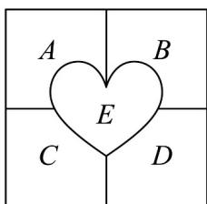

<!-- question-source:start -->
23. 如图，某心形花坛中有 $A, B, C, D, E^5$ 个区域，每个区域只种植一种颜色的花。

(1)要把 $^{5}$ 种不同颜色的花种植到这 $^{5}$ 个区域中，每种颜色的花都必须种植，共有多少种不同的种植方案？

(2)要把 $^{4}$ 种不同颜色的花种植到这 $^{5}$ 个区域中，每种颜色的花都必须种植，共有多少种不同的种植方案？

(3)要把红、黄、蓝、白 $^{4}$ 种不同颜色的花种植到这 $^{5}$ 个区域中，每种颜色的花都必须种植，要求相同颜色的花不能相邻种植，且有两个相邻的区域种植红、黄 $^{2}$ 种不同颜色的花，共有多少种不同的种植方案？
<!-- question-source:end -->

![[高中/课堂同步/题库/人教A版高中数学同步讲义(2026)/05_选择性必修第三册/第六章 计数原理/专题03 排列六大常考题型（高效培优专项训练）/题型三_全排列问题/questions/answers/Q00083715A1.md]]
