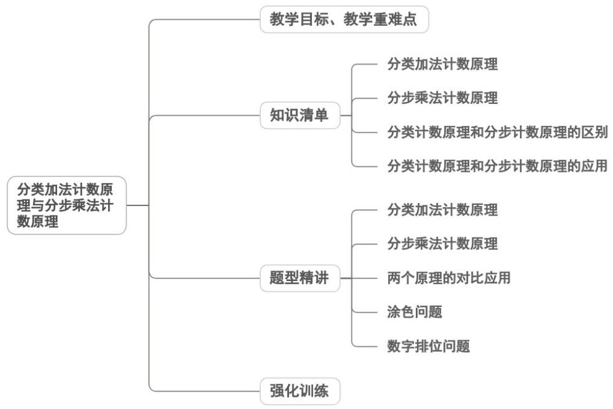

<!-- source-part:1 pages:1-39 -->

教学目标、教学重难点
专题6.1 分类加法计数原理与分步乘法计数原理


<table><tr><td>教学目标</td><td>1.知识与技能理解两个计数原理的核心内涵,能区分分类与分步的本质差异,会用原理解决简单的计数问题。2.过程与方法通过实例分析、对比归纳,培养分类讨论、逻辑推理的思维能力,掌握计数问题的基本分析方法。3.情感态度与价值观感受计数原理在生活和数学中的应用价值,培养严谨的思维习惯,提升数学抽象与建模素养。</td></tr><tr><td>教学重难点</td><td>重点</td></tr></table>

```txt
1. 理解分类加法计数原理（分类、互斥、相加）和分步乘法计数原理（分步、依存、相乘）的核心概念。
2. 能根据问题特征，准确判断是分类还是分步，并运用对应原理进行计数。
难点
1. 区分实际问题中的分类与分步，明确分类的“互斥性”和分步的“连续性”。
2. 复杂问题中做到分类不重不漏、分步步骤合理，能结合两个原理解决综合计数问题。
```

## 知识清单

## 知识点 01 分类加法计数原理

## 1. 分类加法计数原理：

完成一件事,有 n 类办法.在第 1 类办法中有 $m_{1}$ 种不同方法,在第 2 类办法中有 $m_{2}$ 种不同的方法,……,在第 n 类办法中有 $m_{n}$ 种不同方法,那么完成这件事共有 $N = m_{1} + m_{2} + \cdots + m_{n}$ 种不同的方法.

## 2. 加法原理的特点是：

① 完成一件事有若干不同方法，这些方法可以分成 n 类；

② 用每一类中的每一种方法都可以完成这件事；

③ 把每一类的方法数相加，就可以得到完成这件事的所有方法数。

## 【即学即练】

小夏计划某日从武汉到兰州游玩，当天的交通工具中，火车共有 $^{12}$ 个车次，飞机共有 $^{2}$ 个航班，则乘坐方式
的种数共有（）
A. 12    B. 14    C. 16    D. 24

【答案】B

【分析】根据分类加法计数原理即可求解·

【详解】根据分类加法计数原理，从武汉到兰州可以乘火车（ $^{12}$ 种）或飞机（ $^{2}$ 种），总计 $12+2=14$ 种方式．
故选：B

2. 现某学校自愿组成数学建模社团，其中高一年级 $^{3}$ 人，高二年级 $^{4}$ 人，高三年级 $^{6}$ 人，选其中一人为负责人，有多少种不同的选法？（）

【答案】
A. 13    B. 78    C. 18    D. 20

【答案】A
【分析】根据分类加法计数原理直接计算即可·
【详解】根据题意，选择其中一人为负责人，共有三种情况：
若选出的是高一学生，有 $^{3}$ 种情况；
若选出的是高二学生，有 $^{4}$ 种情况；
若选出的是高三学生，有 $^{6}$ 种情况·

由分类加法计数原理可得：共有 $3 + 4 + 6 = 13$ 种不同的选法·

故选：A

## 知识点 02 分步乘法计数原理

## 1. 分步乘法计数原理

“做一件事，完成它需要分成 n 个步骤”，就是说完成这件事的任何一种方法，都要分成 n 个步骤，要完成这

件事必须并且只需连续完成这 n 个步骤后，这件事才算完成。

2. 乘法原理的特点：

① 完成一件事需要经过 n 个步骤，缺一不可；

② 完成每一步有若干种方法；

③ 把每一步的方法数相乘，就可以得到完成这件事的所有方法数。

## 【即学即练】

1.3 名同学计划去 A, B, C, D 四个景点游玩，每人只去 1 个景点，则不同的选法种数是 \_\_\_\_ · (用数字

作答）

【答案】64

【分析】根据分步乘法计数原理计算·

【详解】由题意知，每位同学均有 $^{4}$ 个选择，所以不同选法种数是 $4^{3}=64$ .

故答案为：64

2. 小李同学有三件不同颜色的羽绒服以及两条不同颜色的棉裤，如果一件羽绒服和一条棉裤配成一套，则小

李同学不同的搭配种数为（ ）A.5 B.6 C.8 D.9

【答案】B

【分析】根据分步乘法计数原理可得·

【详解】先选羽绒服有 $^{3}$ 种情况，再选棉裤有 $^{2}$ 种情况，根据分步乘法计数原理，共有搭配种数 $3 \times 2 = 6$

故选:B.

## 知识点 03 分类计数原理和分步计数原理的区别

分类计数原理和分步计数原理的区别：

两个原理的区别在于一个和分类有关，一个和分步有关.

完成一件事的方法种数若需“分类”思考，则这n类办法是相互独立的，且无论哪一类办法中的哪一种方法都

能单独完成这件事，则用加法原理；

若完成某件事需分 n 个步骤，这 n 个步骤相互依存，具有连续性，当且仅当这 n 个步骤依次都完成后，这件

事才算完成，则完成这件事的方法的种数需用乘法原理计算。

【即学即练】

1. 从 $0 \sim 9$ 这十个数字中选取 $3$ 个数，能组成无重复数字的三位偶数 \_\_\_\_ 个（用数字作答）

【答案】328

【分析】按照 $^{0}$ 是否在末位分类讨论即可求解·

【详解】末位是 $^{0}$ 时：末位有 $^{1}$ 种选法，十位有 $^{9}$ 种选法，百位有 $^{8}$ 种选法，

故末位是 $^{0}$ 的三位偶数有 $1 \times 9 \times 8 = 72$ ;

末位不是 $^{0}$ 时：个位有4种选法，百位有有8种选法，十位有8种选法，

故末位不是 $^{0}$ 的三位偶数有 $4 \times 8 \times 8 = 256$ ;

所以共有 $72 + 256 = 328$ 个。

故答案为：328·

2．某学校举办春季运动会，高一、高二、高三三个年级分别有 5、4、3 个班级参加 400 米接力赛·若每个

年级至少有一个班级参加，且高一年级必须有偶数个班级参加，则不同的参赛方案共有 \_\_\_\_ 种

【答案】1575

【分析】先根据条件确定高一的参赛班数只能是 $^{2}$ 个或 $^{4}$ 个，然后分情况计算组合数，最后将两种情况的结

果相加即可·

【详解】高一有 $^{5}$ 个班，至少一个班级且偶数个班级参赛，因此高一的参赛班数只能是 $^{2}$ 个或 $^{4}$ 个.

若高一选 $^{2}$ 个班： $C_{5}^{2}=10$ ，高二至少选 $^{1}$ 个班： $2^{4}-1=15$ ，高三至少选 $^{1}$ 个班： $2^{3}-1=7$ ，

方案数： $10 \times 15 \times 7 = 1050$ ；

若高一选 $^{4}$ 个班： $C_{5}^{4}=5$ ，高二至少选 $^{1}$ 个班： $2^{4}-1=15$ ，高三至少选 $^{1}$ 个班： $2^{3}-1=7$ ，

方案数： $5 \times 15 \times 7 = 525$ ；

两种情况方案数相加得 $1050 + 525 = 1575$

因此不同的参赛方案共有1575种·

故答案为：1575.

## 知识点 04 分类计数原理和分步计数原理的应用

利用两个基本原理解决具体问题时的思考程序：

(1) 首先明确要完成的事件是什么，条件有哪些？

(2) 然后考虑如何完成？主要有三种类型

①分类或分步。②先分类，再在每一类里再分步。③先分步，再在每一步里再分类，等等。

（3）最后考虑每一类或每一步的不同方法数是多少？

【即学即练】

1. 甲乙两人分别从标有数字 $^{1,2,3,4,\cdots,13}$ 的 $^{13}$ 张卡片中各抽取一张，甲乙取得的卡片上的数字分别记为a，

b ，则满足 $2^{a} + 3^{b}$ 的个位数字为 9 的有序数对 $(a, b)$ 的个数为 \_\_\_\_.

【答案】33

【分析】先讨论 $2^{a}, 3^{b}$ 的个位数字情况，再结合题意进行分析，最后利用分步乘法计数原理和分类加法计数原

理求解即可·

【详解】若满足 $2^{a} + 3^{b}$ 的个位数字为9，则先讨论 $2^{a}, 3^{b}$ 的个位数字情况，

对于 $2^{a}$ ，当 a=1 时，个位数字为 2，当 a=2 时，个位数字为 4，

当 $a = 3$ 时，个位数字为8，当 $a = 4$ 时，个位数字为6，当 $a = 5$ 时，个位数字为2，

发现个位数字的周期为 4，只能为 2,4,8,6

对于 $3^{b}$ ，当 $b = 1$ 时，个位数字为3，当 $b = 2$ 时，个位数字为9，

当 $b = 3$ 时，个位数字为7，当 $b = 4$ 时，个位数字为1，当 $b = 5$ 时，个位数字为3，

发现个位数字的周期为 4，只能为 3,9,7,1

若满足 $2^{a} + 3^{b}$ 的个位数字为9，则有如下情况，

$2^{a}$ 的个位数字为 2 与 $3^{b}$ 的个位数字为 7， $2^{a}$ 的个位数字为 8 与 $3^{b}$ 的个位数字为 1，

$2^{a}$ 的个位数字为 6 与 $3^{b}$ 的个位数字为 3，

当 $2^{a}$ 的个位数字为2时，有4种符合题意的情况，

当 $3^{b}$ 的个位数字为7时，有3种符合题意的情况，

由分步乘法计数原理得共有 $4 \times 3 = 12$ 种情况，

当 $2^{a}$ 的个位数字为8时，有3种符合题意的情况，

当 $3^{b}$ 的个位数字为1时，有3种符合题意的情况，

由分步乘法计数原理得共有 $3 \times 3 = 9$ 种情况，

当 $2^{a}$ 的个位数字为6时，有3种符合题意的情况，

当 $3^{b}$ 的个位数字为 3 时，有 4 种符合题意的情况，

由分步乘法计数原理得共有 $3 \times 4 = 12$ 种情况，

由分类加法计数原理得共有 $12+9+12=33$ 种情况·

故答案为：33

2.5名同学分别报名参加学校的足球队、篮球队、乒乓球队，每人限报其中的一个运动队，则不同的报名方法种数是（）

【答案】
A. 81 B. 100 C. 125 D. 243

【答案】D

【分析】分析可知每个同学都有 $^{3}$ 种选择，结合分步乘法计数原理可得结果·

【详解】5名同学分别报名参加学校的足球队、篮球队、乒乓球队，每人限报其中的一个运动队，

则每个同学都有 $^{3}$ 种选择，由分步乘法计数原理可知，不同的报名方法种数为 $3^{5}=243$ 种·

故选：D.

## 题型精讲

![[高中/课堂同步/题库/人教A版高中数学同步讲义(2026)/05_选择性必修第三册/第六章 计数原理/专题6.1 分类加法计数原理与分步乘法计数原理（高效培优讲义）/题型01_分类加法计数原理/题型01_分类加法计数原理.md]]
![[高中/课堂同步/题库/人教A版高中数学同步讲义(2026)/05_选择性必修第三册/第六章 计数原理/专题6.1 分类加法计数原理与分步乘法计数原理（高效培优讲义）/题型02_分步乘法计数原理/题型02_分步乘法计数原理.md]]
![[高中/课堂同步/题库/人教A版高中数学同步讲义(2026)/05_选择性必修第三册/第六章 计数原理/专题6.1 分类加法计数原理与分步乘法计数原理（高效培优讲义）/题型03_两个原理的对比应用/题型03_两个原理的对比应用.md]]
![[高中/课堂同步/题库/人教A版高中数学同步讲义(2026)/05_选择性必修第三册/第六章 计数原理/专题6.1 分类加法计数原理与分步乘法计数原理（高效培优讲义）/题型04_涂色问题/题型04_涂色问题.md]]
![[高中/课堂同步/题库/人教A版高中数学同步讲义(2026)/05_选择性必修第三册/第六章 计数原理/专题6.1 分类加法计数原理与分步乘法计数原理（高效培优讲义）/题型05_数字排位问题/题型05_数字排位问题.md]]
![[高中/课堂同步/题库/人教A版高中数学同步讲义(2026)/05_选择性必修第三册/第六章 计数原理/专题6.1 分类加法计数原理与分步乘法计数原理（高效培优讲义）/强化训练/强化训练.md]]
