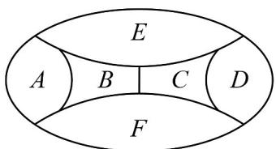

> [!faq]- 《专题6.1 分类加法计数原理与分步乘法计数原理（高效培优讲义）》官方解析
>
> > [!success]- **【答案】**  A 72 B 96 C 120 D 144
>
> > [!note]- **【分析】**
> > 根据分类相加计数原理，先分四种颜色都用和只有三种颜色两种情况，再根据分步乘法计数原理，
> >
> > 将涂色过程分成若干步，每一步确定一个区域的颜色，再根据相邻区域不同色的条件，确定每一步的涂色方
> >
> > 案数，最后将各步方法数相乘得到总的涂色方案数·
>
> > [!note]- **【解析】**
> > 设四种颜色分别为 1、2、3、4，
> >
> > (1) 四种颜色都用：
> >
> > 先涂区域 B，有 $^{4}$ 种填涂方案，不妨设涂颜色 $^{1}$ ，
> >
> > 再涂区域 C，有 $^{3}$ 种填涂方案，不妨设涂颜色 $^{2}$ ，
> >
> > 再涂区域 E，有 $^{2}$ 种填涂方案，不妨设涂颜色 $^{3}$ ，
> >
> > 若区域 A 填涂颜色 $^{2}$ ，则区域 D, F 填涂颜色 1、4 或 4、3，
> >
> > 若区域 A 填涂颜色 $^{4}$ ，则区域 D, F 填涂颜色 1、3 或 4、3，
> >
> > 共 $^{4}$ 种不同的填涂方法·由分步乘法计数原理可得，共有 $4\times3\times2\times4=96$ 种不同的涂法·
> >
> > (2) 四种颜色只用其中的三种颜色：
> >
> > 即当 A, C 同色，B, D 同色，E, F 同色，共有 $4 \times 3 \times 2 = 24$ 种不同的涂法。
> >
> > 综上所述，根据分类相加计数原理可得，共有 $24 + 96 = 120$ 种不同涂法
> >
> > 故选：C
> >
> > 10. 将 $^{4}$ 个不同的小球放入 $^{4}$ 个不同的盒子中，则恰有两个盒子为空的放法种数为（）
> >
> > 【答案】
> > A 72 B 84 C 96 D 108
> >
> > 【答案】B
> >
> > 【分析】利用先选后排的方法进行解题即可·
> >
> > 【详解】选2个空盒： $C_{4}^{2}=\frac{4!}{2!(4-2)!}=6$ 种，
> >
> > 分配4个小球到2个非空盒
> >
> > 情况一（1+3分法）： $C_{2}^{1}C_{4}^{1}=2\times4=8$ 种
> >
> > 情况二（2+2分法）： $\frac{C_{4}^{2}}{2!}\times A_{2}^{2}=\frac{6}{2}\times2=6$ 种
> >
> > 总分配方法； $8+6=14$ 种，
> >
> > 总放法数： $6 \times 14 = 84$ 种
> >
> > 故选：B
> >
> > 11. 我们称各个数位上的数字之和为 $^{8}$ 的三位数为“幸运数”，例如 $^{107}$ 和 $^{224}$ ，则所有的“幸运数”共有（）
> >
> > 【答案】
> > A. 66 个    B. 55 个    C. 36 个    D. 28 个
> >
> > 【答案】C
> >
> > 【分析】按照首位数字为 $1 \sim 8$ 进行分类，相加得到答案
> >
> > 【详解】当首位数字为 $^{1}$ 时，后两位相加为 $^{7}$ ，“幸运数”分别是116,161,125,152,134,143,107,170，共8个；
> >
> > 当首位数字为 $^{2}$ 时，后两位相加为 $^{6}$ ，“幸运数”分别是206,260,215,251,224,242,233，共 $^{7}$ 个；
> >
> > 当首位数字为 $^{3}$ 时，后两位相加为 $^{5}$ ，“幸运数”分别是305,350,314,341,323,332，共 $^{6}$ 个；
> >
> > 当首位数字为 $^{4}$ 时，后两位相加为 $^{4}$ ，“幸运数”分别是404,440,413,431,422，共5个；
> >
> > 当首位数字为 $^{5}$ 时，后两位相加为 $^{3}$ ，“幸运数”分别是503,530,512,521，共 $^{4}$ 个；
> >
> > 当首位数字为 $^{6}$ 时，后两位相加为 $^{2}$ ，“幸运数”分别是602,620,611，共 $^{3}$ 个；
> >
> > 当首位数字为 $^{7}$ 时，后两位相加为 $^{1}$ ，“幸运数”分别是 $^{701,710}$ ，共 $^{2}$ 个；
> >
> > 当首位数字为 $^{8}$ 时，后两位相加为 $^{0}$ ，“幸运数”是 $^{800}$ ，共 $^{1}$ 个.
> >
> > 因此，所有的“幸运数”共有 $8 + 7 + 6 + 5 + 4 + 3 + 2 + 1 = 36$ 个.
> >
> > 故选 **C**.
