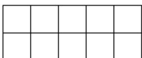

<!-- question-source:start -->
12．在图所示的 $^{10}$ 块地中，选出 6 块种植 $A_{1}$ 、 $A_{2}$ 、 $\cdots$ 、 $A_{6}$ 这六个不同品种的蔬菜，每块地种植一种．若

$A_{1}$ 、 $A_{2}$ 、 $A_{3}$ 必须横向相邻种在一起， $A_{4}$ 与 $A_{5}$ 在横向、纵向都不能相邻种在一起，则不同的种植方案有\_

种·

<!-- question-source:end -->

![[高中/课堂同步/题库/人教A版高中数学同步讲义(2026)/05_选择性必修第三册/第六章 计数原理/第六章 计数原理（高效培优单元自测·强化卷）/三_填空题/questions/answers/Q00083922A1.md]]
